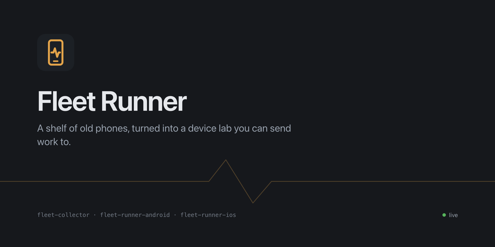
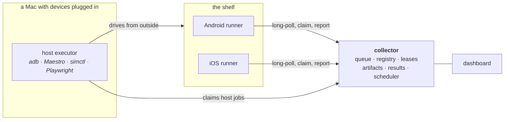

# Fleet Runner

A shelf of old phones, turned into a device lab you can send work to.

One queued job installs a build on every attached device, runs a UI suite
across them, benchmarks llama.cpp on real silicon, classifies a few hundred
images through Core ML and LiteRT, screenshots a website on two real phone
screens and diffs it against a baseline, or drains a battery on purpose and
plots the curve. Everything lands in one results database with one dashboard
in front of it.

Built to answer a question I could not otherwise answer: **would on-device
machine learning actually be good enough to ship in my apps, and on which
hardware?** It turned out to be yes, and the fleet is how I know.

## The repositories

| | What it is |
|---|---|
| **[fleet-collector](https://github.com/addisdev/fleet-collector)** | The brain. Device registry, job queue with leases, artifact store, results database, scheduler, alert engine, and the dashboard above. Node + Fastify + SQLite, no broker, no cloud. |
| **[fleet-runner-android](https://github.com/addisdev/fleet-runner-android)** | The Android agent. A foreground service on anything back to Android 7, with llama.cpp (NDK/JNI) and LiteRT backends. |
| **[fleet-runner-ios](https://github.com/addisdev/fleet-runner-ios)** | The iOS agent. SwiftUI, with llama.cpp and Core ML backends, speaking the same JSON protocol without sharing a line of code. |

## How it fits together

**Device jobs** are claimed by the app on the phone itself. **Host jobs** are
claimed by an executor on a Mac and drive a device from outside, because
installing an APK or tapping through a UI test is not something an app can do
to itself.

The two runners share a protocol, not code — including a synthetic SHA-256
benchmark that is identical on both platforms token for token. That is what
lets a 2019 Android phone and a current iPhone produce numbers you can put in
the same table, which is the difference between a fleet and a pile of phones.

## What came out of it

The first real payload was a product question: my plant app identified species
by sending photos to a cloud API. Could that run on-device instead — offline,
at zero per-call cost, and on what minimum hardware?

The fleet answered it. Every device pulled the same eval set and the same
model by content hash, applied bit-identical preprocessing, and reported
accuracy and per-image latency.

| Device | Model | Top-1 | Top-5 | p50 |
|---|---|---|---|---|
| SM-X930 (Dimensity 9400) | ResNet18 **int8**, CPU | 76.7% | 88.3% | **7 ms** |
| SM-X930 (Dimensity 9400) | ResNet18 fp32, GPU delegate | 77.5% | 90.0% | 11 ms |
| iPhone 16 sim | Core ML int8-weight (11.8 MB) | 75.8% | 90.8% | 7.6 ms |
| Android emulator (4 GB) | ResNet18 int8, CPU | 76.7% | 88.3% | 11 ms |

Three findings worth the whole build:

1. **int8-on-CPU beat fp32-on-GPU.** 7 ms against 11 ms, and it loaded in 23 ms
   rather than 428 ms. The shipping configuration needs no GPU delegate at
   all, which deletes an entire class of delegate-availability failures.
2. **Top-5 is the product surface.** Fine-grained species confusion is
   inherent, and the misses were visually similar taxa. Five ranked candidates
   turns 77% into a ~90% "it was in the list" experience.
3. **Accuracy was identical on every device** that ran a given model — tablet,
   emulator and host agreeing to the decimal. Only latency varied. That is the
   fixed preprocessing doing its job, and it is what makes the latency numbers
   trustworthy.

Full write-up, including the quantization scripts and the licensing of every
model and dataset: **[the eval](https://github.com/addisdev/fleet-collector/blob/main/evals/greenfolio-plant-id.md)**.

## Things I learned the hard way

- **The iOS Simulator's emulated GPU returned an all-zero logits tensor** for
  this model. Silently. No error, no warning, just zeros — while `.cpuOnly`
  gave logits identical to the Mac. If the eval had not been cross-checked
  against another device, that would have shipped as a real accuracy number.
  The runner now forces CPU on simulators and labels it.
- **macOS gates local-network access per app, and a launchd agent cannot ask
  for it.** The same Node binary that reached the collector fine from Terminal
  got `EHOSTUNREACH` under launchd. Loopback is not gated, so the fix is an
  SSH tunnel and an executor that talks to `127.0.0.1`. Diagnosing that cost
  an evening; the symptom looks exactly like a network problem.
- **A phone on battery throttled decode by roughly 100×.** Benchmarks are
  worthless without device-state honesty, so the runner takes a wakelock, asks
  for a doze exemption, and enforces `require_charging` rather than quietly
  reporting a number produced under thermal duress.
- **Link-preview bots do not run JavaScript.** Open Graph tags injected
  client-side unfurl as nothing on every platform, and a browser-based check
  can never see that bug — it needs the raw HTML, which is the opposite of
  what the rest of the site auditing does.
- **A red nightly that reaches nobody is worse than no nightly.** The alerting
  had to end at a notification on the machine somebody is actually looking at,
  which on a headless host meant a reverse SSH tunnel to get there.

## The original plan

[`docs/plan.html`](docs/plan.html) is the architecture and build plan written
before any of this existed, kept as-is. Every phase in it was built.

## License

MIT — see [LICENSE](LICENSE). Each repository carries its own third-party
notices for what it links.
