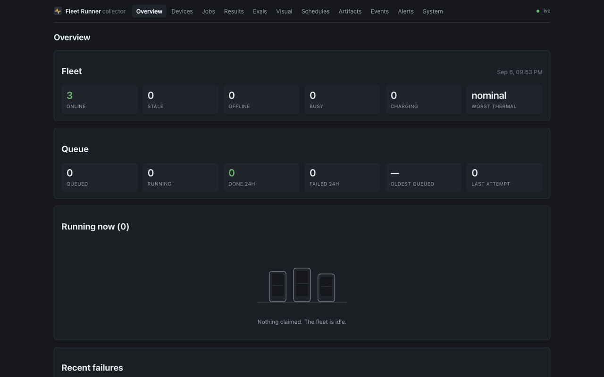
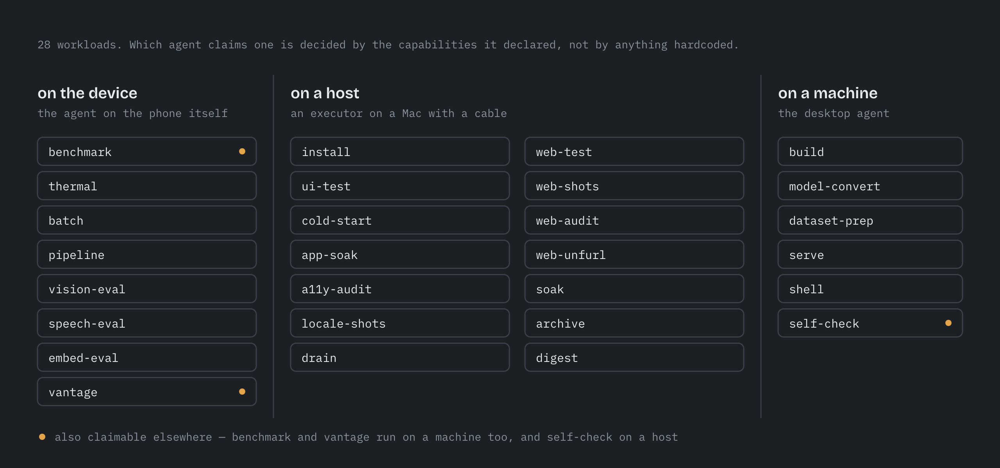

# Fleet Runner

[](https://github.com/addisdev/fleet-runner/actions/workflows/ci.yml)
[](https://addisdev.github.io/fleet-runner/)
[](https://github.com/addisdev/fleet-runner/releases)
[](LICENSE)


A shelf of old phones, turned into a device lab you can send work to.

One queued job installs a build on every attached device, runs a UI suite
across them, benchmarks llama.cpp on real silicon, classifies a few hundred
images through Core ML and LiteRT, screenshots a website on two real phone
screens and diffs it against a baseline, or drains a battery on purpose and
plots the curve. Everything lands in one results database with one dashboard
in front of it.

Built to answer a question I could not otherwise answer: **would on-device
machine learning actually be good enough to ship in my apps, and on which
hardware?** It turned out to be yes, and the fleet is how I know.


## Eighteen seconds



One `POST /jobs` with `"fanout": true`, and every agent the expression matches
claims its own child job. Above: a laptop and two browser runners on a collector
that did not exist a minute earlier. Nothing there is staged — it is the
shipping agents against a real collector, recorded a frame every 250 ms.

## Run it

```
fleet up
```

That is a collector (the brain: registry, queue, results, dashboard) and a
machine agent (this laptop, as a device on the fleet), each in its own process,
both supervised. No configuration file to write, no broker, no cloud service.
`fleet doctor` says what the machine can and cannot run, and why not.

```
curl -fsSL https://raw.githubusercontent.com/addisdev/fleet-runner/main/install.sh | sh
```

> The installer verifies the download against the release's `SHASUMS256.txt` and
> refuses to install if it does not match. It needs Node 22.13 or newer and
> carries no runtime of its own. **`fleet up` itself has been watched to work on
> macOS/arm64 only** -- CI runs the suites on Windows and Linux, which is not the
> same as somebody having run a fleet on one.
> **[docs/install/](https://addisdev.github.io/fleet-runner/install/)** is honest
> per platform.

## Documentation

**[addisdev.github.io/fleet-runner](https://addisdev.github.io/fleet-runner/)**

| | |
|---|---|
| **[Install](https://addisdev.github.io/fleet-runner/install/)** | Getting `fleet` onto macOS, Windows, Linux or Docker, and getting a phone, a television, a Roku or a browser to join it. |
| **[Get started](https://addisdev.github.io/fleet-runner/getting-started/)** | `fleet up`, a real job, and a result on the dashboard. Needs Node 22.13 and nothing else -- no Xcode, no NDK, no phone. |
| **[Wire in your own app](https://addisdev.github.io/fleet-runner/integration/)** | Publish builds on merge, run a nightly on your own devices, and block a pull request on the verdict. |
| **[The protocol](https://addisdev.github.io/fleet-runner/protocol/)** | Register, long-poll, claim, beacon, report. Enough to write a runner in a language none of these are in. |

## How it fits together


**Device jobs** are claimed by the app on the phone itself. **Host jobs** are
claimed by an executor on a Mac and drive a device from outside, because
installing an APK or tapping through a UI test is not something an app can do
to itself.

"Phone" is no longer the whole story. An agent declares what platform it runs
and what shape it is, so these five runners cover Android phones, tablets,
TV sticks, headsets and watches; iPhone, iPad and Apple TV; macOS, Linux and
Windows machines; Roku players and Roku TVs; and any browser at all. Which of those have actually been
watched to register, and which are only believed to work, is
**[docs/platforms.md](docs/platforms.md)** — with an honest column, because a
list of platforms a project "supports" is worth very little.

The runners share a protocol, not code — including a synthetic SHA-256
benchmark that is identical on every platform token for token. That is what
lets a 2019 Android phone, a current iPhone and a laptop produce numbers you can
put in the same table, which is the difference between a fleet and a pile of
phones.

A runner also says what it can run. The queue routes on those declared
capabilities rather than on a label someone applied, so adding a workload is
something a runner can do without the collector shipping a release.

## What it can run



Twenty-eight workloads, and the column a workload sits in is the answer to
"who can physically do this". A benchmark runs inside the app on the phone. An
install needs a cable and a Mac. A build needs a checkout and a toolchain.
Each has [its own page](https://addisdev.github.io/fleet-runner/workloads/),
saying what it measures and what it refuses to guess.

## What is in here

Seven projects in one repository, in three groups: **one brain**, **five
runners** that speak its protocol and share no code with each other or with it,
and **two front doors** onto the whole thing. They ship independently but they
are versioned together, because the protocol is the thing that breaks and a
change to it touches three of them at once.

**The brain**

| | What it is |
|---|---|
| **[collector/](collector)** | Device registry, job queue with leases, artifact store, results database, scheduler, alert engine, and the dashboard above. Node + Fastify + SQLite, no broker, no cloud. It also holds the host executor, which drives phones from outside over adb, simctl and devicectl. |

**The runners** -- five hand-written implementations of one protocol, in five
languages, sharing not one line

| | What it is |
|---|---|
| **[runner-android/](runner-android)** | Kotlin. A foreground service on anything back to Android 7, with llama.cpp (NDK/JNI) and LiteRT backends. One APK covers phones, tablets, TV sticks, headsets and watches. |
| **[runner-ios/](runner-ios)** | Swift. SwiftUI, with llama.cpp and Core ML backends. The same sources build the tvOS and visionOS targets -- two conditions rather than a fork. |
| **[runner-machine/](runner-machine)** | TypeScript. A Node process that makes a laptop, desktop, board or NAS a fleet device, so a phone's tok/s and a laptop's land in the same table. |
| **[collector/runner-web/](collector/runner-web)** | JavaScript, one HTML file the collector serves at `/runner`: opening it enrols the browser that opened it. A smart TV, a console, a Chromebook -- anything with no way to install a signed app. |
| **[runner-roku/](runner-roku)** | BrightScript, because it is the only language a Roku will run. A SceneGraph channel, so a streaming player or a Roku TV is a fleet device. It has never been run on a Roku, and it has never been *compiled* -- there is no emulator -- so read its README before you read a number from it. |

**The front doors**

| | What it is |
|---|---|
| **[fleet/](fleet)** | The CLI. `fleet up` runs this machine's components under a supervisor that backs off and gives up loudly rather than restarting a broken component forever; `fleet doctor` says what the machine can run and why not; `fleet service install` keeps it up. It wraps the three programs above and reimplements none of them. |
| **[desktop/](desktop)** | A Tauri menu-bar app around that CLI: a tray menu, role switches, the dashboard in a window, and a notification when a component gives up. It exists to test one hypothesis about macOS local-network permissions, and **none of its Rust has ever been compiled** -- read its README before believing anything in it. |

Each directory has its own README, its own tests and its own CI job, filtered by
path so a change to a phone runner does not build the dashboard.

### Why one repository

These were four repositories until the protocol started changing. A metric name
lives in `collector/schemas/result.schema.json` and is mirrored by hand in three
runners; a capability list is declared by an agent and enforced by the queue.
Every one of those is a change that has to land in several places at once, and
across repositories it lands in several pull requests that can each merge alone.
The drift is not hypothetical — an eval's accuracy once rode in a field named
`decode_tok_s` because vision had no field of its own, and no query can
reproduce that report's numbers today.

One repository makes such a change one reviewable diff, and lets `npm test`
in `collector/` fail when the schema and its mirror disagree.

Five hand-written implementations of one protocol stay honest because there is
a test for it. `npm run conformance -- --device <id>` drives a running agent
through nine clauses — every one of them something that has actually gone
wrong here — including recomputing the synthetic backend's block digest from
the written specification, so "identical token for token" is checkable rather
than asserted.

## What came out of it

The first real payload was a product question: my plant app identified species
by sending photos to a cloud API. Could that run on-device instead — offline,
at zero per-call cost, and on what minimum hardware?

The fleet answered it. Every device pulled the same eval set and the same
model by content hash, applied bit-identical preprocessing, and reported
accuracy and per-image latency.

| Device | Model | Top-1 | Top-5 | p50 |
|---|---|---|---|---|
| SM-X930 (Dimensity 9400) | ResNet18 **int8**, CPU | 76.7% | 88.3% | **7 ms** |
| SM-X930 (Dimensity 9400) | ResNet18 fp32, GPU delegate | 77.5% | 90.0% | 11 ms |
| iPhone 16 sim | Core ML int8-weight (11.8 MB) | 75.8% | 90.8% | 7.6 ms |
| Android emulator (4 GB) | ResNet18 int8, CPU | 76.7% | 88.3% | 11 ms |

Three findings worth the whole build:

1. **int8-on-CPU beat fp32-on-GPU.** 7 ms against 11 ms, and it loaded in 23 ms
   rather than 428 ms. The shipping configuration needs no GPU delegate at
   all, which deletes an entire class of delegate-availability failures.
2. **Top-5 is the product surface.** Fine-grained species confusion is
   inherent, and the misses were visually similar taxa. Five ranked candidates
   turns 77% into a ~90% "it was in the list" experience.
3. **Accuracy was identical on every device** that ran a given model — tablet,
   emulator and host agreeing to the decimal. Only latency varied. That is the
   fixed preprocessing doing its job, and it is what makes the latency numbers
   trustworthy.

Full write-up, including the quantization scripts and the licensing of every
model and dataset: **[the eval](collector/evals/greenfolio-plant-id.md)**.

## Things I learned the hard way

- **The iOS Simulator's emulated GPU returned an all-zero logits tensor** for
  this model. Silently. No error, no warning, just zeros — while `.cpuOnly`
  gave logits identical to the Mac. If the eval had not been cross-checked
  against another device, that would have shipped as a real accuracy number.
  The runner now forces CPU on simulators and labels it.
- **macOS gates local-network access per app, and a launchd agent cannot ask
  for it.** The same Node binary that reached the collector fine from Terminal
  got `EHOSTUNREACH` under launchd. Loopback is not gated, so the fix is an
  SSH tunnel and an executor that talks to `127.0.0.1`. Diagnosing that cost
  an evening; the symptom looks exactly like a network problem.
- **A phone on battery throttled decode by roughly 100×.** Benchmarks are
  worthless without device-state honesty, so the runner takes a wakelock, asks
  for a doze exemption, and enforces `require_charging` rather than quietly
  reporting a number produced under thermal duress.
- **Link-preview bots do not run JavaScript.** Open Graph tags injected
  client-side unfurl as nothing on every platform, and a browser-based check
  can never see that bug — it needs the raw HTML, which is the opposite of
  what the rest of the site auditing does.
- **A red nightly that reaches nobody is worse than no nightly.** The alerting
  had to end at a notification on the machine somebody is actually looking at,
  which on a headless host meant a reverse SSH tunnel to get there.

## The original plan

[The architecture and build plan](https://addisdev.github.io/fleet-runner/history/plan.html)
written before any of this existed, kept as-is. Every phase in it was built.

## Contributing

The most useful thing you can send is **a device report** — what your hardware
measured, what it refused, and what broke. The point of the project is
comparable numbers across hardware nobody has a lab full of, and every phone
that is not on this shelf is data this repository does not have.

[`CONTRIBUTING.md`](CONTRIBUTING.md) has how to run each component's suite and
the handful of things this project learned the hard way. Behaviour is covered by
the [Contributor Covenant](CODE_OF_CONDUCT.md).

**There is no authentication, by design** — the collector is built for a home
LAN or a tailnet. [`SECURITY.md`](SECURITY.md) says what that does and does not
cover before you report it.

## License

MIT — see [LICENSE](LICENSE). Each component carries its own third-party
notices for what it links.
