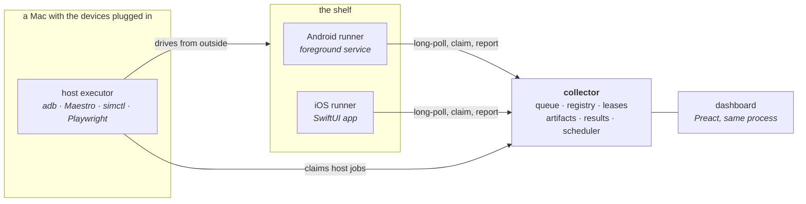

# fleet-collector

The brain of **Fleet Runner**: a personal device lab that turns a shelf of old
phones into something you can send work to. It holds the device registry, the
job queue, the artifact store, the results database, and the dashboard.

One queued job can install a build on every attached device, run a Maestro or
XCUITest suite across them, benchmark llama.cpp on real silicon, classify a
few hundred images through Core ML and LiteRT, screenshot a website on two
real phones and diff it against a baseline, or drain a battery on purpose and
plot the curve. The runners are separate apps —
[iOS](https://github.com/addisdev/fleet-runner-ios) and
[Android](https://github.com/addisdev/fleet-runner-android) — that speak a
shared JSON protocol, not shared code.

Node + Fastify + SQLite in WAL mode. No build step for the server, no broker,
no cloud.


## How it fits together



Two kinds of job. **Device jobs** are claimed by the runner app on the phone
itself — benchmarks, batch inference, vision evals. **Host jobs** are claimed
by an executor on a Mac and drive a device from outside, because installing an
APK or tapping through a UI test is not something an app can do to itself.

## Run it

Needs Node 22 or newer. Nothing else.

```bash
npm install
npm start                # collector + dashboard on http://127.0.0.1:8788
```

That is a working collector against an empty database. To see it do something,
build a runner from one of the app repos, point it at this address, and enqueue
a job:

```bash
curl -X POST http://127.0.0.1:8788/jobs -H 'content-type: application/json' -d '{
  "schema": 1, "job_id": "bench-1", "workload": "benchmark",
  "executor": "device", "backend": "synthetic",
  "params": { "prompt_tokens": 256, "gen_tokens": 64, "measure_iters": 3 },
  "targets": { "pool": "ml-capable" }
}'
```

```bash
npm test                 # typecheck, build the dashboard, run the suite
npm run executor         # host executor: claims host jobs, drives devices
npm run dash:dev         # dashboard dev server, proxying /api
```

`npm test` starts its own collector on a spare port with a temporary database,
so it never touches a real fleet's history.

## The workloads

| Workload | Runs on | What it does |
|---|---|---|
| `benchmark` | device | Prefill/decode tok/s via llama.cpp, or a synthetic SHA-256 backend that is identical on both platforms so old hardware still produces comparable numbers |
| `batch` / `pipeline` | device | Real generation over a set of inputs, or staged work across several devices |
| `vision-eval` | device | Top-1/top-5 accuracy and per-image latency for an image classifier, via Core ML or LiteRT |
| `install` | host | One artifact onto every attached device — `adb install`, or `simctl`/`devicectl` |
| `ui-test` | host | Maestro flows or an XCUITest bundle per device, JUnit parsed back into results |
| `web-test` / `web-shots` | host | Playwright suites, and visual-regression captures diffed against an accepted baseline — including on real phone screens |
| `web-audit` / `web-unfurl` | host | Crawl-and-audit with a real browser; and the raw HTML that link-preview bots actually see, which is a different answer |
| `thermal` | device | The same benchmark run back to back for a quarter hour, so the answer is a curve: does the cold number survive the device getting warm |
| `cold-start` | host | Launch the installed build from cold, warm and hot; p50 and p95 per state, per device |
| `drain` / `soak` | host | Battery curve under a replayed GPX track; and whether a runner is still alive hours later |
| `archive` / `digest` | host | Pull store reviews and Search Console data; then have the shelf summarize its own reviews using its own models |

Full reference, including every parameter and the failure modes worth knowing:
**[docs/operations.md](docs/operations.md)**.

## Status and threat model

Built and running: every phase of the original plan, a dashboard with live
updates over SSE, an alert engine, and a scheduler. The first real payload was
an [on-device plant-ID evaluation](evals/greenfolio-plant-id.md) across both
platforms — 77% top-1 at 7 ms per image on a phone, which answered a product
question that had been guesswork.

**There is no authentication, by design.** The collector is reachable on a home
LAN and is meant to stay that way; anyone who can reach it can enqueue a job.
`FLEET_DASH_TOKEN` guards the dashboard's mutations, but that is a speed bump
against a stray browser tab, not an access control — `POST /jobs` stays open so
`curl` and CI keep working. Do not put this on the internet. If you want to,
the honest starting point is that every endpoint would need to be re-thought,
not that a token would need to be added.

That posture depends on every agent being on the same LAN, which stops being
true the moment one of them is a laptop that leaves the house. `FLEET_BIND`
is the knob for that case: a comma-separated list of addresses to answer on,
defaulting to every interface. Set it to loopback plus the host's own tailnet
address and the collector is reachable from your own devices anywhere and from
nothing else — no port forward, no hotel wifi, no guest network.

```bash
FLEET_BIND=127.0.0.1,100.x.y.z npm start
```

The network is the access control either way. `FLEET_BIND` only decides which
network that is.

## License

MIT — see [LICENSE](LICENSE). Third-party components and the licensing of the
models and datasets used by the evals are in
[THIRD_PARTY_NOTICES.md](THIRD_PARTY_NOTICES.md).
