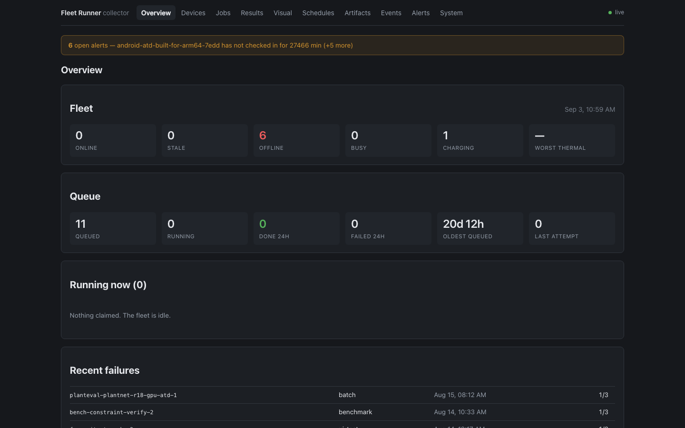
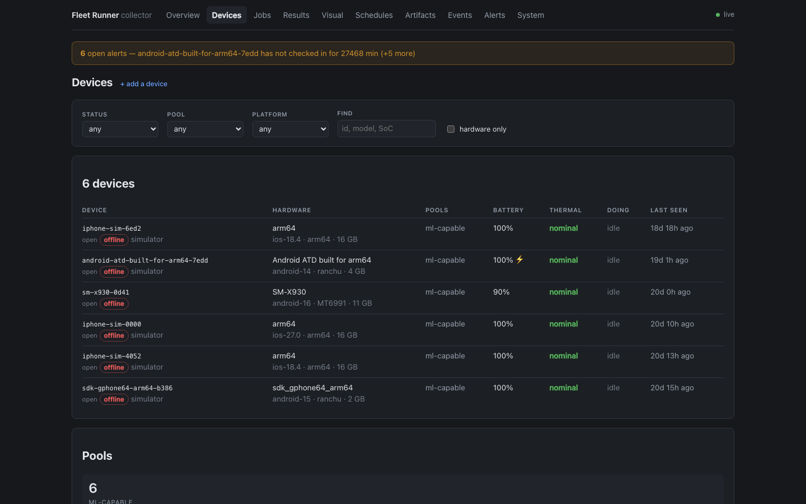
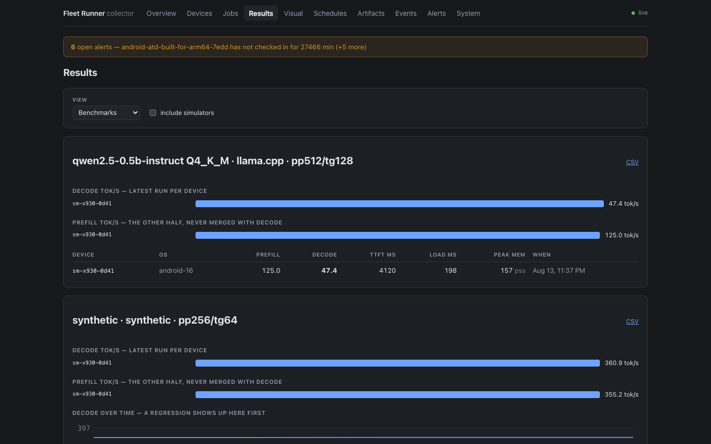

# Operating the collector

The reference manual: every workload the fleet knows how to run, where the
services live, and the failure modes that cost real time to diagnose. If you
only want it running, the [README](../README.md) is enough.

## The workloads in detail

The host executor (Phase 2) handles `install` (artifact → `adb install` on every
attached device) and `ui-test` (`maestro test` per device, JUnit report parsed
and uploaded back as an artifact). Flows resolve relative to `flows/`
(`FLEET_FLOWS_DIR` to change); iOS via devicectl/XCUITest is Phase 3.

It also handles `web-test` on hosts started with `FLEET_WEB=1`: Playwright
suites from `web-specs/` (`FLEET_WEB_SPECS_DIR` to change) against
`targets.url`, one result row per config project. `params.browser` picks the
project(s) — one name, an array run in sequence, or `"all"` for everything in
`playwright.config.ts` (three desktop engines plus emulated-mobile profiles);
the executor beacons between projects, so the lease budgets one project, not
the whole matrix.

`web-shots` is the capture half of the visual-regression matrix: it reads
`web-specs/<site>/shots.json` — pages (`name`, `path`, optional `waitFor`,
`mask` selectors, `fullPage`, `settle_ms`) plus the profiles to capture under,
with the same `params.browser` override forms as web-test — screenshots every
page × profile via `web-specs/_shots/capture.spec.ts`, and uploads the PNGs.

Two profile names are meta-names that expand to real hardware attached to the
claiming executor, one profile (and one baseline) per device — two phones have
two screens: `android-device` becomes `android:<serial>` per fleet-owned
Android device, real Chrome driven via Playwright over adb; `ios-sim-safari`
becomes `ios-sim:<name>` per booted fleet-owned simulator, Safari via
`simctl openurl` + screenshot with the status bar pinned to Apple's 9:41
(no waitFor/mask/fullPage there — `settle_ms` per page stands in, and
Safari's own chrome is in frame). Device captures hold collector device locks
for the run. A meta-name that finds no hardware fails its slot rather than
quietly shrinking the matrix — pin device captures to the executor whose
shelf holds the devices, as their own job if the browser profiles run
elsewhere. Real-iPhone Safari has no capture path yet.

Three site-health workloads round out the web suite. `web-audit` crawls
`targets.url` with a real browser (these are SPAs; fetch would bless a blank
body), audits every rendered page — titles/descriptions/canonicals and their
site-wide duplicates, h1s, JSON-LD validity, redirect chains, broken internal
links with who-links-them, bounded external-link checks, sitemap-vs-crawl
diff, robots.txt sanity — then re-renders each page under a phone profile for
the mobile-friendliness pass (viewport meta, content overflow, tiny text and
tap targets). Config in `web-specs/<site>/audit.json`; error-severity
findings fail the run, warnings only land in `issues_warn` and the report
artifact. `web-unfurl` fetches the RAW HTML the way link-preview bots do (no
JavaScript — og tags injected client-side unfurl as nothing, which is the bug
this exists to catch), under several bot user-agents, and validates
og/twitter tags plus the og:image itself; pages in
`web-specs/<site>/unfurl.json`. `archive` (params.source `"gsc"`) pulls one
finalized day of Search Console data into the artifact store — Google keeps
16 months, the fleet keeps forever. Its credential is a Keychain item on the
executor host (base64 of the service-account JSON; the job spec names the
account only, per the no-secrets-in-specs rule), and until that item and the
Google-side service account exist the job fails with instructions.

`archive` also pulls store reviews: `source: "asc"` (App Store Connect,
ES256 API key) and `source: "play"` (Play Console, the same Google
service-account grant with the androidpublisher scope). Play returns roughly
the last seven days of reviews and nothing older, so the review pulls run
daily — a lazy cadence loses data permanently. Reviews are normalized to one
shape at pull time and archived as `reviews-<source>-<app>-<date>.json`.

`digest` is the weekly payoff: the host executor gathers the week's review
artifacts, dedupes by review id (minus the previous digest's watermark), and
farms the LLM work to the shelf as ordinary `batch` jobs — one pass
classifying every review against a fixed topic taxonomy, deterministic
clustering in code between passes, one pass summarizing each cluster — then
assembles a markdown digest (`review-digest-<date>.md`) with real quotes
chosen in code, never generated. The job's `model` names the gguf the shelf
runs; devices are matched with `ram_mb >= 4000` and `require_charging`. Rows
follow drain's shape: per-page at iter 1..N, per-profile summary at iter 0,
host row closes the job. Each captured page is diffed (pixelmatch, on the
executor — baselines are only comparable to pixels rendered by the same host)
against the baseline the collector holds for (suite, page, profile); a page
over its `threshold_pct` (per-page or manifest-wide, default 0.1%) fails with
`metrics.diff_pct` and a diff-image artifact, a page with no baseline passes
with a "new: no baseline" note until someone accepts a shot via
`POST /api/visual/baselines/accept` (token-guarded, and the artifact must
exist in the store). `GET /api/visual/baselines?suite=` lists the accepted
set. Baseline shas must survive any future artifact GC.

Smoke against a collector you started for the purpose, never the live one — it
enqueues jobs a real device could claim. Give it its own port and data dir:

```bash
FLEET_DATA_DIR=/tmp/fleet-test FLEET_ARTIFACT_DIR=/tmp/fleet-test/store FLEET_PORT=8799 npm start
```

then `FLEET_URL=http://127.0.0.1:8799 npm run smoke`.

## Where it runs

The collector lives on **fleet-host** (`fleet-host.local:8788`) — a spare
2016 MacBook Pro that does nothing else. It is deliberately sudo-free:
Node is a user-local tarball in `~/.local/node`, the service is a LaunchAgent in
`~/Library/LaunchAgents`, and `better-sqlite3` installs from a prebuild, so the
whole stack can be rebuilt over SSH with nobody at the keyboard. Deploy with
[`deploy/adopt-fleet-host.sh`](../deploy/adopt-fleet-host.sh) and the
`*.fleet-host.plist` variant.

Executors stay on whichever machine the devices are physically attached to —
they reach the collector over the LAN with `FLEET_URL`:

```bash
FLEET_URL=http://fleet-host.local:8788 npm run executor
```

Runner apps ship with a loopback default and take the host's address in their
own settings screen, so nothing is baked into a binary. Give the host a DHCP
reservation, or reach it by its `.local` name; a lease change would otherwise
strand every device at once.

## Running under launchd

[`deploy/com.addisdev.fleet-collector.plist`](../deploy/com.addisdev.fleet-collector.plist)
keeps the collector up: `KeepAlive` revives it however it dies, which is the
point — the fleet's devices long-poll this service, so a crash that goes
unnoticed strands every runner.

The plists in `deploy/` are templates: they carry `__PLACEHOLDER__` paths
rather than anyone's home directory, because a LaunchAgent cannot expand `~`
and an absolute path that is wrong fails in the least obvious way possible.
[`deploy/install-agent.sh`](../deploy/install-agent.sh) fills them in from the
machine it runs on and loads the result:

```bash
deploy/install-agent.sh com.addisdev.fleet-collector.plist
```

Pass `--print` to see the filled-in plist without installing it.

- **Stop it** with `launchctl bootout gui/$(id -u)/com.addisdev.fleet-collector`.
  Killing the process does nothing lasting; launchd starts it straight back.
- **Do not `npm start` while it is loaded** — the port is taken, and the second
  copy exits with `EADDRINUSE` while looking, for a moment, like it worked.
- **Logs** go to `~/Library/Logs/fleet-collector.log` (both streams). launchd
  does not rotate it and the collector logs a line per request, so check its size
  occasionally.
- **Paths inside the plist are absolute**, including the data and artifact dirs.
  Move the checkout and you must edit them.
- This is a LaunchAgent, so it starts **at login**, not at boot. A Mac mini that
  reboots unattended needs either automatic login, or the same job installed as a
  root-owned LaunchDaemon in `/Library/LaunchDaemons`.

After `npm install` upgrades tsx, confirm `node_modules/tsx/dist/cli.mjs` still
exists — the plist invokes it directly to avoid depending on a login `PATH`.

## Endpoints

| Method & path | Purpose |
|---|---|
| `POST /devices/register` | Device checks in with descriptor + pool tags (upsert) |
| `GET /devices/:id/next-job` | Long-poll (~25 s) for `executor: "device"` work; 204 when none |
| `GET /executor/next-job` | Long-poll for `executor: "host"` work (`?name=` labels the claimant) |
| `POST /jobs` | Enqueue a job spec (curl, CI, or the future scheduler); 409 on duplicate `job_id` |
| `GET /jobs/:id` | Job status, including `attempts`, `lease_deadline`, and `last_error` |
| `POST /jobs/sweep` | Force a lease sweep now; returns the `job_id`s requeued and failed |
| `POST /results` | Result rows (`kind: "result"`, idempotent by job/device/iter) and telemetry (`kind: "beacon"`, which renews the job's lease); `final: true` closes the job |
| `POST /artifacts` | Upload raw bytes (models or app builds); returns `sha256` |
| `GET /artifacts/:sha256` | Download, supports Range requests |
| `POST /schedules` / `GET /schedules` | Upsert / list cron schedules (5-field cron + job template, `enabled` off by default) |
| `PATCH /schedules/:id` / `DELETE /schedules/:id` | Enable/disable or remove a schedule |
| `POST /schedules/tick` | Force a scheduler evaluation now (fires due schedules at most once per minute) |
| `POST /locks/acquire` / `POST /locks/release` | Host-executor device locks for `targets.exclusive` jobs; device-executor claims lock implicitly |
| `POST /power/:pool/:state` | Fire the pool's smart-plug webhook (`on`/`off`) from `power.json` — see `power.example.json` |
| `POST /events/:topic` | Publish a pipeline event (JSON payload); returns its id |
| `GET /events/:topic/poll?after=<id>` | Long-poll the next event past the cursor; 204 on expiry |
| `GET /api/visual/baselines` | Accepted visual baselines (`?suite=` to filter); the executor diffs web-shots against these |
| `GET /api/visual/suites` / `GET /api/visual/matrix?suite=` | Suites with visual history, and the review grid: latest run's cells judged pass/diverged/new/missing plus per-cell history — the dashboard's Visual page |
| `POST /api/visual/baselines/accept` | Set the baseline for (suite, page, profile) to an artifact already in the store (token-guarded) |
| `GET /dash` | Dashboard SPA (see below) |
| `GET /dash/legacy` / `GET /dash/legacy/bench` | Server-rendered dashboard / cross-device benchmark comparison |
| `GET /api/*` | Dashboard read API (see below) |

Batch jobs (`workload: batch`) take `params.input_sha256` (an artifact of
`{"items": [...]}`), process each item on the device (llama.cpp generates,
synthetic digests), and upload the outputs as a new artifact referenced from
the final result. Pipeline jobs (`workload: pipeline`) subscribe to
`params.topic`, process each event's `prompt`, and publish to `<topic>.out` —
the tiered-pipeline pattern with the collector as the broker. Runners enforce
`constraints.require_charging` / `min_battery_pct` before running: an
on-battery Samsung was observed to throttle decode ~100x with the screen off,
which is exactly the lie those constraints exist to prevent.

`POST /jobs` with `"fanout": true` (device-executor only) enqueues one pinned
child job per registered device in `targets.pool` — a whole-shelf benchmark is
one request. Nightly runs are schedules whose template does exactly that.

## CI integration — built, deliberately OFF

Nothing in any app repo or CI system references the fleet today. What exists,
dark, is the full contract:

- Jobs may carry `report_to.github_status: "owner/repo@sha"`. When such a job
  closes, the collector records a row in `status_reports` — and **only posts a
  real GitHub commit status when armed** with `FLEET_GITHUB_STATUS=1` and
  `FLEET_GITHUB_TOKEN`. Unarmed (the default), the row says `posted=0, dry run`;
  `GET /status-reports` is the audit trail either way.
- [`scripts/ci-enqueue.ts`](../scripts/ci-enqueue.ts) is the CI step: uploads the
  build artifact, enqueues the job, polls to the verdict, exits 0/1.
- [`ci/example-workflow.yml`](../ci/example-workflow.yml) documents the workflow an
  app repo would adopt at connect time. It is installed nowhere.

Turning CI on later is: arm the two env vars on the collector, add the secret +
workflow to an app repo, and let its self-hosted runner reach the collector
over Tailscale. Until then the fleet stays fully disconnected from real CI.

Job and result shapes are documented in [`schemas/`](../schemas/) (`"schema": 1`).

## Dashboard

Served by the collector itself at `/dash`, from the same process and the same
SQLite file — one thing to keep alive, one URL, no CORS.

| | |
|---|---|
|  |  |
| **Overview** — fleet and queue at a glance, and what is running right now | **Devices** — every phone on the shelf with battery, thermal state and what it is doing |
|  |  |
| **Jobs** — the queue, with a composer and cancel/retry | **Results** — benchmark trends, vision-eval accuracy, UI-test matrices, drain curves |


The plan this was built from, including what is still outstanding on the runner
side, is [`docs/dashboard-plan.md`](dashboard-plan.md).

`/dash` is a Preact SPA in [`dash/`](../dash/), built by Vite to `dash/dist` and
served straight from this process — one service, one URL, no CORS. The build is
**optional**: with no `dash/dist` the collector serves a page telling you to run
`npm run dash:build`, and everything else keeps working. `dash/dist` is
gitignored, so a fresh checkout on fleet-host needs `npm run dash:install &&
npm run dash:build` once (pure-JS deps plus esbuild's per-platform binary — no
sudo, same as the rest of the stack).

The server-rendered tables that used to be `/dash` still live at
[`/dash/legacy`](../src/dash.ts). They have no build step, so they remain the
fallback when the bundle is missing or broken. They go away once the SPA reaches
parity.

Building the dashboard is what `dash:build` does; `dash:dev` runs Vite's dev
server on :5178 and proxies `/api` to `FLEET_URL` (default `127.0.0.1:8788`), so
you can develop the UI against the live fleet without a mock.

**What is built (plan D0–D6 — the dashboard plan is complete):** the read API, the live event stream, and the
Overview, Devices, Jobs, Schedules and System screens — including device detail
with a 24 h battery/thermal chart, job detail with per-device results and
artifacts, and filters that live in the URL so a filtered view is a link you can
send. Jobs can be composed, enqueued, cancelled, retried and reprioritised from
the browser; devices can be renamed, annotated and re-pooled. Results has views
for benchmarks, vision evals, UI tests, drain and soak. Schedules can be
enabled, fired now and deleted; artifacts can be uploaded and garbage-collected;
events can be tailed; and the System screen runs sweeps, scheduler ticks, pool
power and retention. Alerts appear as a banner on every screen. The layout works
on a phone, and `?` lists the keyboard shortcuts (`g j` jobs, `g d` devices,
`g n` new job, `/` search).

The legacy dashboard has **no unique feature left** — the cross-device benchmark
comparison now lives in the SPA — but it is deliberately kept. It is
server-rendered with no build step, so it is the only dashboard that works from
a bare checkout or when a bundle fails to build. That, and nothing else, is now
its job.

### Naming devices

A device id is a machine's answer to "who are you" — `sm-x930-0d41`,
`sdk-gphone64-arm64-b386`. Fine in a job spec, useless for knowing which slab of
glass on the shelf just went thermally critical at 3am.

**Click a device's name in the list to rename it.** There is no separate
nickname: the name is what the device is called, and an unnamed device shows its
id because until you name it, that is its name. Enter or clicking away saves,
Escape cancels.

The name then appears everywhere the dashboard prints that device — the
overview's running-now and recent results, job targets and result rows, held
locks, alert text. The id stays available on hover and on the device's own page,
since it is what job specs pin and what `adb devices` prints.

Names are operator-set and survive re-registration, like pool overrides. The
column was called `nickname` until it was renamed in place; existing names carry
over.

### Adding a device

`/dash/devices/new` is the enrolment screen: a QR code of the collector's
address, a download of the newest runner APK straight from the artifact store,
per-platform install steps, and a panel that watches the registry and names the
device the moment it registers.

The QR encodes an address derived from the **host's own network interfaces**,
not from the browser's origin — view the dashboard through an SSH tunnel and
your origin is `127.0.0.1`, which is a fine URL for you and a useless one for a
phone. The screen says so and offers the LAN and tailnet addresses instead.

Artifact downloads take `?filename=`, which sets a `content-disposition` so the
runner arrives on the phone as `fleet-runner-0.2.0.apk` rather than a
64-character hash Android will not offer to install. The name is stripped to
`[A-Za-z0-9._-]` before it reaches the header.

### Vision-eval and drain metrics

Both used to ride in the LLM metric slots — vision put top-1 accuracy in
`decode_tok_s`, p50 in `ttft_ms`, throughput in `prefill_tok_s`; drain put
percent-per-hour in `decode_tok_s` — and top-5 and p95 were computed but had
nowhere to go, reaching only the uploaded report artifact.

**Fixed as of 2026-08-19.** `schemas/result.schema.json` defines `top1_pct`,
`top5_pct`, `p50_ms`, `p95_ms`, `images_per_s` and `drain_pct_per_h`; the
executor and both runner apps emit them. Verified end-to-end against the real
int8 Core ML model and the 120-image eval set, reproducing the published
plant-ID figures (75.8% top-1, 90.8% top-5) from the results table for the first
time.

Rows written before that keep working: the Results screen prefers the named
fields, falls back to the old convention, and marks anything it had to infer.
A pre-fix Core ML row reads `top1: 0.0` because the old code defaulted a missing
accuracy to zero — read those as unknown, not as a result.

### Read API

Every endpoint is `GET` and side-effect free. Timestamps are ISO-8601 **UTC with
a `Z`** — SQLite stores `YYYY-MM-DD HH:MM:SS` with no zone marker, which
JavaScript parses as local time, so the API normalizes rather than leaving each
client to get it wrong. Every list is bounded.

| Endpoint | Purpose |
|---|---|
| `GET /api/overview` | Everything the Overview screen needs, in one call (cached 2 s; `?fresh=1` bypasses) |
| `GET /api/health` | Uptime, node version, collector instance id, connected dashboards |
| `GET /api/system` | DB/artifact/log sizes, row counts per table, CI armed state, power pools, paths |
| `GET /api/devices` | Registry with derived `online`/`stale`/`offline`, current job, lock, flattened beacon; filters: `status`, `pool`, `platform`, `simulator`, `q` |
| `GET /api/devices/:id` | Descriptor, job history, latest benchmarks, counts |
| `GET /api/devices/:id/beacons?hours=24` | Beacon history for the battery/thermal charts, oldest first |
| `GET /api/jobs` | Filters: `status`, `workload`, `executor`, `pool`, `device`, `q`, `has_error`, `from`, `to`; `page`/`per_page`, `sort`/`dir`; returns status facets |
| `GET /api/jobs/:id` | Spec, results, beacons, artifacts (input vs output, and whether they are actually in the store), locks, fan-out parent/siblings/children, status report |
| `GET /api/results` | Filters: `job`, `device`, `workload`, `final`, `ok`, `from`, `to` |
| `GET /api/results/bench` | Latest passing run per device per configuration, with per-device history for trends |
| `GET /api/results/ui` | Per-run verdicts plus a build x device matrix with flaky detection |
| `GET /api/results/vision` | Vision-eval accuracy and latency per model per device; flags inferred values |
| `GET /api/results/drain` | Drain runs: battery curve per device and percent-per-hour |
| `GET /api/results/soak` | Soak runs: the per-check process-alive timeline per device |
| `GET /api/results/recent` | Newest result rows with a one-line summary |
| `GET /api/schedules` | Schedules with computed `next_run` and missed-fire detection |
| `GET /api/artifacts` | Store listing with on-disk state and reference counts |
| `GET /api/events` / `GET /api/events/:topic` | Pipeline topics and their payload tail |
| `GET /api/locks` | Held device locks and how long they have been held |
| `GET /api/stream` | SSE: `job`, `device`, `beacon`, `result`, `lock`, `schedule`, `artifact`, `pipeline-event` |

`/api/stream` carries a nudge, not a payload — an event says "this changed" and
the client refetches. A dropped or duplicated event therefore costs a redundant
GET, never a wrong screen. The `hello` frame carries an `instance` id; a change
in it means the collector restarted and clients should refetch everything.

### Mutations

| Endpoint | Purpose |
|---|---|
| `POST /api/jobs` | Enqueue (the composer's path); forwards to `POST /jobs` so validation and fan-out have one implementation |
| `POST /api/jobs/:id/cancel` | Queued → `cancelled`; claimed → `cancelled` plus lock release |
| `POST /api/jobs/:id/retry` | Clone the spec under `<id>-r2`, optionally onto a different pool or device |
| `PATCH /api/jobs/:id` | Set `priority` |
| `POST /api/jobs/preview-targets` | "N devices match", using the same matcher fan-out uses |
| `PATCH /api/devices/:id` | Nickname, notes, pool override (`pools: null` clears the override) |
| `DELETE /api/devices/:id` | Forget a device; refuses while it is running a job |
| `POST /api/devices/:id/release-lock` | Drop a stuck host-executor lock |
| `GET/POST/DELETE /api/templates[/:id]` | Saved job specs for the composer |
| `POST/PATCH/DELETE /api/schedules[/:id]` | Upsert, enable/disable, delete — forwarded to the `/schedules` routes |
| `POST /api/schedules/:id/run` | Fire one schedule now, without consuming its cron dedup key |
| `GET /api/artifacts/gc-candidates?days=` | Artifacts nothing references, oldest first |
| `DELETE /api/artifacts/:sha256` | Delete one; refuses while a job still references it |
| `POST /api/system/sweep`, `POST /api/system/scheduler-tick` | Force a pass now |
| `POST /api/power/:pool/:state` | Fire a pool's smart-plug webhook |
| `POST /api/system/retention` | Prune old beacons and events; dry-runs unless `dry_run:false` |
| `GET /api/executors` | Host-executor liveness, derived from their long-poll traffic |
| `GET /api/enroll` | Addresses a device can reach this collector on, the newest runner APK, and who is already enrolled |
| `GET /api/alerts?state=` | Current alerts; `open,acked,snoozed` unless asked otherwise |
| `POST /api/alerts/:id/ack`, `POST /api/alerts/:id/snooze` | Quiet one alert; snooze takes `minutes` |
| `POST /api/alerts/tick` | Force an evaluation now |

**Cancelling a claimed job** does not reach into the device. The row goes to
`cancelled`, which means the runner's next beacon returns `lease_renewed: false`
— the same signal a swept lease produces, which runners already handle. Work
already in flight finishes; nothing new starts. A cancelled job is deliberately
*not* `failed`: the overview's failure counts and every alert built on them
would otherwise count deliberate stops as breakage.

**Pool edits** are stored in `devices.pools_override`, not in `pools`. The
runner rewrites `pools` on every registration, so an edit sharing that column
would be gone within the minute. Effective pools — what the queue actually
claims through — are the override when set, otherwise the runner's report; both
stay visible in `GET /api/devices`.

**`FLEET_DASH_TOKEN`** guards every mutation above: set it and the dashboard
must send `X-Fleet-Token`. **It is unset on fleet-host, deliberately.** The
collector is LAN and tailnet only, `POST /jobs` is open anyway so CI and curl
keep working, and the token bought protection against a stray tab at the cost of
a paste in every browser — not a trade worth making on a home network.

Turn it on by adding the variable to the LaunchAgent (there is a commented
example in [`deploy/`](../deploy/)) and restarting. The dashboard notices on its own:
`/api/health` reports `guard`, and a banner appears asking for the token rather
than letting an ordinary action fail on it.

The device and executor paths (`/devices/:id/next-job`, `/executor/next-job`,
`POST /results`) are never guarded either way — the fleet has to keep running
whether or not anyone has a token in a browser.

## The host executor on fleet-host

Host-driven workloads — `install`, `ui-test`, `drain`, `soak` — cannot run inside
an app: they drive a device from *outside*, over adb. So the executor has to live
wherever the devices are physically plugged in, and since fleet-host is the
always-on machine, that is there.

[`deploy/com.addisdev.fleet-executor.fleet-host.plist`](../deploy/com.addisdev.fleet-executor.fleet-host.plist)
runs it under launchd beside the collector, talking to it over loopback so it
does not depend on the LAN address. Everything it needs is user-local, keeping
fleet-host sudo-free and rebuildable over SSH:

| | |
|---|---|
| `~/.local/platform-tools/adb` | Android Debug Bridge 1.0.41, from Google's zip |
| `~/.local/jdk` | Temurin 17, needed only because Maestro is JVM-based |
| `~/.maestro/bin/maestro` | Maestro 2.8 |

**iOS host-driven work is not possible on fleet-host, by design.** `simctl` and
`devicectl` ship with full Xcode, which that machine deliberately does not have —
its `xcrun` is the Command Line Tools stub and cannot find `simctl`. iOS UI tests
run from a Mac that has Xcode. Android host work runs on fleet-host.

Devices must be **physically attached to fleet-host** for it to drive them. With
nothing attached, a host job is claimed and fails cleanly with
`no android targets attached`, which is the correct answer rather than a hang.

## The iOS executor on the workstation

`simctl` needs full Xcode, which fleet-host does not have, so iOS host work runs
on the workstation that hosts the GitHub runners —
[`deploy/com.addisdev.fleet-executor-ios.plist`](../deploy/com.addisdev.fleet-executor-ios.plist),
named `mac-xcode`. It runs **natively, not in the runner's Docker container**:
simulators are driven through the host's CoreSimulator and a Linux container on
macOS cannot reach them.

Jobs reach it with `targets.executor: "mac-xcode"`. Unset stays permissive, so
anything not pinned is claimable by whichever executor is free.

### Why there is an SSH tunnel

macOS 26+ gates local-network access per app, and a process started by launchd
has no grant and no way to prompt for one. The same node binary that reaches
the collector's LAN address from Terminal gets `EHOSTUNREACH` under launchd —
confirmed by running the same fetch both ways.

So [`deploy/com.addisdev.fleet-tunnel.plist`](../deploy/com.addisdev.fleet-tunnel.plist)
forwards `127.0.0.1:18788` to the collector and the executor talks to loopback,
which is not gated. 18788 because 8788 on that machine belongs to another
project.

**The cleaner fix is to grant Local Network access to node in System Settings**
and point `FLEET_URL` back at the LAN address; the tunnel can then be removed.
That needs a human at the keyboard, which is why it is not what is deployed.

## Schedules and targeting

The nightly and weekly runs live in [`scripts/seed-schedules.ts`](../scripts/seed-schedules.ts),
not only in the database. `npm run seed:schedules` upserts them; it is idempotent
and preserves the on/off state of anything already there, so re-running can
never quietly switch off a run someone turned on. New schedules always arrive
disabled.

They target with **`targets.match`, not pools**. A pool is a label someone has
to keep accurate as the shelf changes; a match is a statement about what the job
needs, evaluated against each device's own descriptor when it claims.

The plant-id eval is the case that proves the difference: it is `litert` with a
`.tflite` model, so it is Android-only. Under `pool: ml-capable` it fanned out to
three iOS simulators that cannot load it at all. As
`os ~ 'android' && ram_mb >= 3000` it selects the two Android devices that can —
the 3000 MB floor being what the published eval actually demonstrates, on the
3922 MB ATD emulator.

Pools still exist and devices still report them; nothing routes on them.

## The regression rules

Three rules watch a metric against its own history rather than against a fixed
threshold: `benchmark-regressed`, `cold-start-regressed` and `batch-regressed`.

The comparison key matters more than the threshold. Two runs are only
comparable on the same device with the same model, quant and backend, and
comparing across any of those is how a "regression" turns out to be a different
model. The baseline is the median of the trailing seven days, needs at least
four prior runs, and the alert's subject is keyed on the same tuple the
comparison was — so a device that has genuinely got slower is one alert with a
rising `seen_count`, not a new one every night.

Percent rather than absolute, because the shelf spans a 2016 phone and current
silicon and one threshold in tok/s would be noise on one and silence on the
other.

## Capabilities

A pool is a label a person applied. A **capability** is a statement an agent
makes about its own code and toolchain, sent with every registration:

```json
{ "device_id": "pixel-4a", "descriptor": { … },
  "pools": ["ml-capable"],
  "capabilities": ["benchmark", "batch", "batch:litert", "pipeline"] }
```

The queue never hands an agent a workload it did not declare. That is checked
before `targets.match`, on purpose: an expression narrows the set of eligible
agents, it cannot grant one a workload its code does not contain.

Two rules are worth knowing because they are what keep an upgrade from breaking
a running shelf:

- **No `capabilities` key means "no opinion", not "nothing".** An agent that
  registered before the field existed is offered every workload, exactly as it
  was. An agent that sends `[]` is offered none — the two are different on
  purpose.
- **A re-registration that omits the key keeps what was declared last.** Rolling
  back to an older runner build must not silently widen it back to everything.

A job naming a backend is satisfied two ways: by an agent declaring the pairing
(`batch:litert`) or by one declaring the workload outright (`batch`), which
means it handles every backend it was built with.

`capabilities` is readable from a match expression, so a job can target a
toolchain rather than hardware:

```json
{ "targets": { "match": "capabilities ~ 'build:xcode'" } }
```

### What this changes about `POST /jobs`

The collector used to accept thirteen workload names and refuse everything else.
It now accepts those thirteen — the ones the collector and the host executor
ship with, which is why they need no agent to vouch for them — **plus any
workload some registered agent declares**. Anything else is a 422 naming the
missing capability, at enqueue time, rather than a job that sits queued forever
with nothing to explain why.

The point is that a new runner can add a workload the collector has never heard
of without a release here.

## Network shaping

Any host job may carry `params.network`: `offline`, `offline-after-<n>s`, `3g`
or `lossy`. It is applied before the workload and always restored in a
`finally`, and the intent is journalled to `~/.fleet/network-shape.json` before
the device is touched, so a crash between the two is still recoverable. The
executor restores every attached device on startup, before its first claim — a
phone left offline by a crashed executor is a phone that looks dead forever.

An unknown profile name throws. A typo that silently ran unshaped would turn an
offline test into a test that proves nothing and still passes, which is the one
outcome worth engineering against here.

What is actually reachable is narrower than the vocabulary suggests, and the
refusals are deliberate:

| Profile | Android device | iOS simulator | iOS device |
|---|---|---|---|
| `offline` | `svc wifi disable`, verified afterwards | not supported | not supported |
| `3g` / `lossy` | refused | host `dnctl`/`pfctl`, opt-in | refused |

- **`offline` is refused on an adb-tcp serial.** Disabling wifi there cuts the
  executor's own control channel, leaving no way to restore and a permanently
  stranded phone.
- **`3g` and `lossy` on a real phone are refused**, not approximated. In-device
  shaping needs root, and host dummynet only shapes traffic that transits the
  Mac, which a phone on wifi does not.
- **`simctl status_bar override --dataNetwork` is not used.** It redraws the
  status-bar icon and changes no packet — the purest form of the fake-offline
  trap this module exists to avoid.
- **Cellular data is only re-enabled if the journal says we disabled it.**
  Turning data back on for a device deliberately kept off a metered SIM costs
  real money.

### Host-side shaping is opt-in and needs one-time setup

The `dnctl`/`pfctl` path is gated on three preconditions it verifies rather than
assumes, because pf silently ignores rules loaded into an anchor nothing
references — a no-op that looks exactly like success:

1. `FLEET_NET_SHAPE_HOST=1`
2. passwordless sudo for `dnctl` and `pfctl`
3. a `fleet-shape` anchor actually referenced in `/etc/pf.conf`:

```
dummynet-anchor "fleet-shape"
anchor "fleet-shape"
```

The executor will not edit `/etc/pf.conf` itself. Shaping also requires a scoped
destination (`params.network_to`, or `targets.url`): unscoped, it would shape
the executor's own link to the collector and to adb.

**This path is reasoned through but has not been run.** Adding the anchor and
exercising it once by hand is worth doing before a schedule depends on it.

## Constraints

`constraints` on a job spec is enforced in two places, and which place matters.

`require_charging` and `min_battery_pct` are enforced by the **runner app**, at
claim time, against live state. A device that fails one refuses the job with a
failed result. That is right for a contract about the device: a benchmark on a
throttling phone would produce a number that lies, and a lie recorded as a
result is worse than a failure.

`require_ac`, `require_idle_s`, `max_load` and `window` are enforced by the
**collector**, before the claim, against the device's last beacon. An
unsatisfied one leaves the job queued and offers it again on the next poll. A
laptop that is on battery, or busy, or awake at the wrong hour has not failed at
anything — it is merely unsuitable right now, and burning an attempt on that
would exhaust `max_attempts` on a machine that was working perfectly.

```json
{ "constraints": { "require_ac": true, "require_idle_s": 300, "max_load": 2,
                   "window": { "from": 1, "to": 6 } } }
```

`window` crosses midnight when `from > to`: `22` to `06` is the night, not an
empty set. Stale beacons fail closed — a machine that stopped reporting cannot
be shown to be idle, and guessing permissively is how a benchmark ends up
running while someone is typing.

## Fan-out

`fanout: true` enqueues one child per matching device, pinned with
`targets.device_id` and suffixed `--<device_id>`.

`fanout: { "distinct": "os" }` enqueues one child per distinct value of that
descriptor field, newest-seen first. That is the canary shape: a smoke pass on
every OS on the shelf without paying for every phone.

Host jobs fan out too. A host child is pinned exactly as a device child is, and
the executor's own target selection already honours `targets.device_id`, so an
`install` plus `ui-test` pair can cover the OS matrix with two job specs.

## Artifact pins

The GC reference scan reads job specs, results, schedules and templates. Two
kinds of artifact are safe from deletion without appearing in it:

- **Accepted visual baselines.** A baseline is referenced by a row in
  `baselines`, not by text in any spec, so the scan would have offered every one
  of them for collection — while its entire purpose is to still exist months
  later to diff against. Accepting a shot now pins its artifact, and both the
  GC candidate list and the delete endpoint refuse it by name.
- **Anything pinned by hand**, with a reason. `POST /api/artifacts/:sha/pin`
  takes `{ "pinned": true, "reason": "..." }`. The reason is stored because a
  pin with no reason is one nobody will ever dare remove.

The artifacts page shows this in a "Kept" column, because the only honest
reading of "references: 0" without it is "free to delete", which for a baseline
is exactly wrong.

## Alerts

Evaluated every 60 s (`FLEET_ALERT_TICK_MS`). Alerts are **state, not events**:
one row per (rule, subject) for as long as the condition holds, resolved when it
stops. A device offline for six hours is one row with a rising `seen_count`, not
360 notifications — and nothing is notified twice, ever.

| Rule | Fires when |
|---|---|
| `device-offline` | no check-in for `FLEET_ALERT_DEVICE_OFFLINE_S` (default 15 min) |
| `thermal-critical` | a device still reporting is thermally critical |
| `low-battery` | below `FLEET_ALERT_LOW_BATTERY_PCT` (default 15) and not charging |
| `job-failed` | a job failed in the last 24 h |
| `job-stuck` | claimed, lease still being renewed, but no result rows after 2× the lease TTL |
| `benchmark-regressed` | decode throughput fell more than `FLEET_ALERT_REGRESSION_PCT` (10%) against its own 7-day median |
| `cold-start-regressed` | launch time rose past the same threshold against its own median |
| `batch-regressed` | top-1 accuracy fell past the same threshold |
| `schedule-missed` | an enabled schedule that has run before missed its firing by 5 min |
| `db-size` / `log-size` | past `FLEET_ALERT_DB_BYTES` / `FLEET_ALERT_LOG_BYTES` |

`job-stuck` is the case the lease sweep cannot see: beacons keep renewing the
claim, so the job never lapses, and without this rule a runner that is alive but
producing nothing looks identical to one that is working.

Battery and thermal are only judged on devices still checking in — a reading
from a silent device describes whenever it went silent, not now. And a device
reporting `-1` has no battery telemetry rather than a flat one.

Set `FLEET_ALERT_WEBHOOK` to push newly opened alerts to ntfy or any webhook
receiver; unset (the default) makes the dashboard the only channel.

For a desktop notification instead of a hosted service,
[`scripts/alert-receiver.ts`](../scripts/alert-receiver.ts) is a local webhook
target that raises a macOS notification, installed with
[`deploy/com.addisdev.fleet-alert-receiver.plist`](../deploy/com.addisdev.fleet-alert-receiver.plist).
It runs on the machine somebody is actually looking at, not on the headless
host: point `FLEET_ALERT_WEBHOOK` at the collector's own `127.0.0.1:8790` and
let the tunnel's reverse forward deliver it. Loopback at both ends — the alert
never crosses the LAN and never leaves the house.

Acknowledge keeps an alert listed but stops it nagging; snooze quiets it for N
minutes and it returns on its own. Only the condition clearing resolves an
alert.

## Leases

A claim is a lease, not a permanent handoff. Without one, a runner that dies
mid-job — an emulator's low-memory killer taking out the process, a flat
battery, a yanked cable — leaves the job `claimed` forever and someone has to
mark it failed by hand in sqlite.

- Claiming a job sets `lease_deadline = now + lease.ttl_s` and bumps `attempts`.
- The runner posts `POST /results` with `kind: "beacon"` and the `job_id` to push
  the deadline out. The response's `lease_renewed: false` means the claim is
  gone (swept or already closed) and the runner should stop working the job.
- A sweep runs every 15 s (`FLEET_SWEEP_MS`) and on startup, and can be forced
  with `POST /jobs/sweep`. Lapsed claims go back to `queued` for another device
  to pick up; once `attempts` reaches `lease.max_attempts` the job is marked
  `failed` instead. Either way `last_error` records what happened, and the
  dashboard shows it under the job row.

Defaults are 600 s and 3 attempts, per job via `lease.ttl_s` / `lease.max_attempts`.
`drain` and `soak` default to 14400 s, since they run for hours between beacons.
Pick a TTL longer than the worst-case gap between beacons for that workload — too
short and the collector requeues a job that is still running fine.

## Phase 0 scope notes

- Artifact uploads are buffered in memory — fine for smoke tests and APKs,
  needs streaming before multi-GB models (Phase 2).
- `targets.match` expressions and `targets.exclusive` locks are accepted but not
  enforced yet (Phase 4 alongside pools/scheduler).
- No scheduler yet: nightly runs arrive when cron enqueues land in Phase 4.
