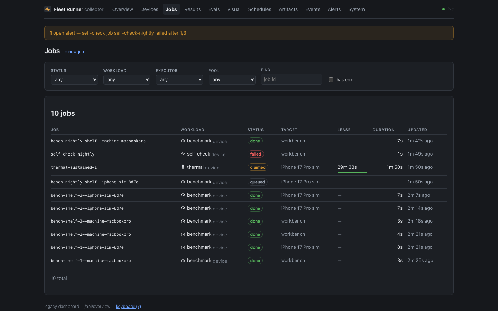

# The dashboard

Served by the collector itself at `/dash`, from the same process and the same
SQLite file. One thing to keep alive, one URL, no CORS.

| | |
|---|---|
|  |  |
| **Overview** — the fleet and the queue at a glance, and what is running now | **Devices** — every phone on the shelf with battery, thermal state and what it is doing |
|  |  |
| **Jobs** — the queue, with a composer and cancel/retry | **Results** — benchmark trends, eval accuracy, UI-test matrices, drain curves |

## Building it

The dashboard is a Preact app with its own `package.json`, built by Vite, and
its output is gitignored. **The build is optional**: with no `dash/dist` the
collector serves a page telling you to run it, and everything else keeps
working.

```bash
npm run dash:install && npm run dash:build
npm run dash:dev     # Vite on :5178, proxying /api to a live collector
```

`dash:dev` proxies to `FLEET_URL`, so you can develop the UI against the real
fleet without a mock.

## What is there

The Overview, Devices, Jobs, Schedules, Evals, Visual, Artifacts, Events,
Alerts and System screens, with live updates over SSE. Device detail has a 24 h
battery and thermal chart; job detail has per-device results, beacons and
artifacts.

**Filters live in the URL**, so a filtered view is a link you can send. Jobs can
be composed, enqueued, cancelled, retried and reprioritised; devices can be
renamed, annotated and re-pooled; schedules enabled, fired now and deleted;
artifacts uploaded and garbage-collected.

Alerts appear as a banner on every screen. The layout works on a phone, and `?`
lists the keyboard shortcuts — `g j` jobs, `g d` devices, `g n` new job, `/`
search.

## Naming devices

A device id is a machine's answer to "who are you" — `sm-x930-0d41`,
`sdk-gphone64-arm64-b386`. Fine in a job spec, useless for knowing which slab of
glass on the shelf just went thermally critical at 3am.

**Click a device's name in the list to rename it.** There is no separate
nickname field: the name is what the device is called, and an unnamed device
shows its id because until you name it, that is its name.

The name then appears everywhere the dashboard prints that device. The id stays
available on hover and on the device's own page, since it is what job specs pin
and what `adb devices` prints.

Names are operator-set and survive re-registration, like pool overrides — see
[why pool edits go to a different column](api.md#pool-edits-go-to-a-different-column).

## Adding a device

`/dash/devices/new` is the enrolment screen: a QR code of the collector's
address, a download of the newest runner build straight from the artifact store,
per-platform install steps, and a panel that watches the registry and names the
device the moment it registers.

**The QR encodes an address derived from the host's own network interfaces**,
not from the browser's origin. View the dashboard through an SSH tunnel and your
origin is `127.0.0.1`, which is a fine URL for you and a useless one for a
phone. The screen says so and offers the LAN and tailnet addresses instead.

Artifact downloads take `?filename=`, which sets a `content-disposition` so the
runner arrives on the phone as `fleet-runner-0.2.0.apk` rather than a
64-character hash Android will not offer to install.

## The legacy dashboard

The server-rendered tables that used to be `/dash` still live at `/dash/legacy`.
They have **no unique feature left** — the cross-device benchmark comparison
moved into the app — but they are deliberately kept.

They have no build step, so they are the only dashboard that works from a bare
checkout or when a bundle fails to build. That, and nothing else, is now their
job.
