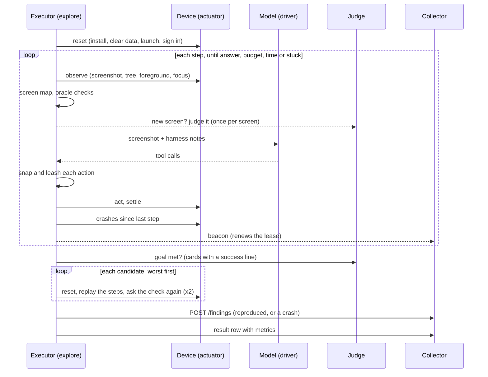

# How a night works

One `explore` job is one night on one or more devices. For each device it runs
mission cards in order until the night's budget is spent, then confirms what it
found and files what holds up.

## Before the first step

**Reset.** The app is installed from the job's build (when the job names one),
force-stopped, its data cleared, and launched with the card's launch arguments.
On Android the install uses `-g`, so runtime permissions start granted and the
explorer does not spend its first steps on dialogs it would see every night.

**Sign in.** A card with a `setup_flow` runs that Maestro flow next. Its
variables come from the job's `credentials`, resolved from the executor host's
Keychain; a card whose flow needs a variable the job did not supply is skipped
with the reason, rather than failing at its setup every night.

**Baseline.** The crash and ANR logs are read once, so everything counted later
is new.

## One step

The order inside a step is the design.

1. **Observe.** Screenshot, UI tree, which app is in front, where focus is (on
   a TV), whether a keyboard is up. On Android the screenshot and tree are taken
   at the same time: on a TV whose channel bar hides six seconds after the last
   key, a slow look loses the bar the model just opened.
2. **Place it.** The [screen map](#the-screen-map) says which screen this is,
   whether any night has seen it, and whether this run has.
3. **Check it**, with no model involved: a blank screen, the app no longer in
   front, a control that did nothing when tapped twice, four steps where nothing
   changed, accessibility (once per screen, once it has settled). Then the
   **judge** looks at any screen new to this run.
4. **Ask.** The model gets the screenshot and a few lines from the harness:
   the step count, whether the screen is new, and, after ten steps without a
   new screen, the names of screens it has not reached yet.
5. **Leash.** Each action is [snapped](safety.md#snapping) onto the element
   under it and refused if that element is a
   [dangerous control](safety.md#what-is-refused).
6. **Act**, then wait for the screen to settle: 450 ms after a key on a TV,
   500 ms after typing, 700 ms after a scroll, 900 ms after a tap.
7. **Crash check.** The platform's crash and ANR logs since the last step. A
   crash is a candidate, the app is relaunched, and the model is told.

Nothing stops a mission except its own ending. Leaving the app is undone (Back,
then a relaunch if that did not work) and noted on the step. A crash is a
candidate and the app comes back.

## How a mission ends

| `ended_by` | When |
|---|---|
| `answer` | The model called `answer`: it thinks it is done |
| `budget` | The card's step budget (default 40) ran out |
| `time` | The card's minutes (default 30) or the night ran out |
| `stuck` | 18 steps without reaching a screen this run had not seen |
| `model` | More than three replies in a row with no usable tool call |
| `device` | More than three failed looks at the device in a row |

At the end the final screen is checked against the card's `check` (bench
cards) or shown to the judge with the card's `success` line (exploration
cards).

## Candidates, not findings

Everything a check raises is a **candidate**. Up to six per mission are
replayed, worst first: high severity before low, then the ones the oracles
raised before the judge's, before the agent's own reports. Candidates with the
same fingerprint are replayed once.

A replay resets the app exactly as the mission did, signs in again, plays the
recorded actions up to the moment the candidate appeared, and asks the same
question again:

| Check | Asked again as |
|---|---|
| `crash`, `anr` | A new crash with the same signature (normalised) |
| `blank` | The app in front and the screen one flat colour |
| `frozen` | Press Back: still identical, still in front |
| `dead_control` | Tap the same point: picture and tree unchanged |
| `a11y` | After two seconds to settle, the same control still unlabelled |
| `visual` | The judge, on the replay's screen, names the same class |
| `goal` | The judge, with the card's success line, says not met |

It does this twice (`replay_attempts`). What happens next:

- **Reproduced at least once** → filed, with the count ("reproduced 2/2",
  "flaky 1/2").
- **A crash that did not reproduce** → filed anyway, marked "crash log": the
  platform's own log is the evidence, and a crash that needs the exact timing
  of the first run is still a crash.
- **Anything else that did not reproduce** → dropped, and counted in
  `explore_not_reproduced`.

At most `findings_per_night` (default 5) **new** findings are filed per app per
night. Ones the collector has already seen are always filed, because filing
them only raises their count.

## The screen map

A screen's identity is what is on it structurally: resource ids and
accessibility identifiers, the classes of its tappable controls, and its short
static labels. Numbers, dates and long text are left out, so a list of three
plants and a list of thirty are the same screen and a ticking clock does not
make a new one. Two observations are the same screen when those sets overlap by
at least 60%; without a tree, a picture hash decides.

The map is a JSON file per app on the executor host
(`~/.fleet/explore/<app>/screenmap.json`) and grows night over night. It does
three jobs:

- **Novelty.** The model hears whether the screen is new, which turns a random
  walk into exploration.
- **Names.** Findings say "Plant detail", taken from the most title-like text
  near the top of the screen, rather than a hash.
- **Memory.** The second night starts knowing the first night's screens, and is
  pointed at the ones it has not reached.

## Fingerprints and duplicates

A finding's fingerprint is a hash of the app, the surface (touch or D-pad), the
screen, the check, and the message with its numbers, hex values, ids and quoted
strings stripped. The collector merges on it, so a crash seen again tomorrow
raises `seen_count` and records the new build instead of making a second report.

Crashes and ANRs are fingerprinted **without** the screen: the same exception
reached from two screens is one bug in shared code, and splitting it would
double the morning list.

## Conditions

A night can rotate missions through conditions: dark mode, the largest text,
another language, a slow or absent network, landscape, and a trip to the
background and back. Each mission runs under one, in turn. They are set through
the same journalled modules `a11y-audit` and `locale-shots` use, so a device is
never left in Spanish at the largest text if the executor crashes. See
[the job spec](job.md#conditions).

## Aimed at today's work

With `params.changed`, the day's commits are read, file names are turned into
screen words (`PlantDetailScreen.kt` gives "plant" and "detail"), and cards
whose `screens` match go first. The words are also given to the model as a
hint. At twenty seconds a step a night holds roughly a dozen missions, so the
order matters more than the list.

## Old or new

With `params.previous_app`, every reproduced finding is replayed once more on
the previous build. The finding then says either "new in this build" or "also
happens on the previous build".
