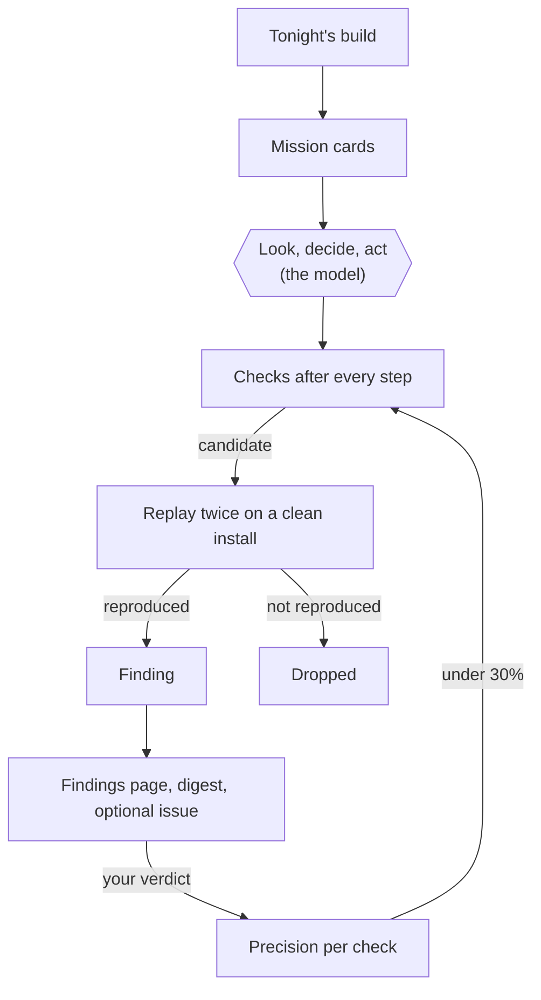

# Exploratory QA

A vision model uses tonight's build the way a person would, and leaves a short
list of reproduced bugs for the morning.

Scripted UI tests check what somebody thought to write down. `explore` looks
for what nobody did: a crash two screens past the happy path, a button that
does nothing, a form that throws on a decimal, a label that overlaps its value
in Spanish. A model reads each screenshot and picks the next action; the
harness checks that action, performs it, and looks for trouble after every
step. Nothing it sees is believed until it happens again on a clean install.

## What you get in the morning

Each finding on the dashboard's **Findings** page has:

- the screenshot at the moment it happened;
- the steps that led there, in words ("On *Add plant*: type "a few" into
  Name, tap Save");
- the evidence: the crash log, the judge's description, or the control that did
  nothing;
- how it replayed ("reproduced 2/2", "flaky 1/2", or "crash log" when the
  crash itself is the evidence);
- a contact sheet of the walk that led there, the full trajectory, and a
  **Maestro flow** (or a tvloop flow, on a Roku) that replays it;
- four buttons: **Real**, **Duplicate**, **Not a bug**, **Agent's mistake**.

The same finding seen again on a later night raises a count rather than making
a second report. Your verdicts decide which checks keep running.

## What it can drive

| Surface | How | State |
|---|---|---|
| Android phones and tablets | adb, by touch | Verified on an emulator with a real model |
| Fire TV and Android TV | adb, by D-pad | Verified on an emulator with a real model |
| iOS and tvOS simulators | the [FleetDriver](surfaces.md#apple-devices-fleetdriver) UI-test bundle | Verified on 26.5 simulators, without a model |
| iPhones and Apple TVs | FleetDriver over the CoreDevice tunnel | Written, never run |
| Roku | [tvloop](surfaces.md#roku-through-tvloop) | Verified on tvloop's fake Roku; a real Roku needs its developer password |

## Where to go next

-   __[Try it on a laptop](quickstart.md)__

    ---

    A small open model, an emulator, the bug garden, and a scored night in
    about half an hour.

-   __[How a night works](how-it-works.md)__

    ---

    The loop, the checks, the replay, and why nothing is filed on one sighting.

-   __[Mission cards](missions.md)__

    ---

    What the explorer is told to do, per app, and how to write a good one.

-   __[The job spec](job.md)__

    ---

    Every parameter, environment variable, metric and artifact.

-   __[Models and the gateway](models.md)__

    ---

    What a model needs, the tool dialect it is spoken to in, and how to pick
    one.

-   __[Devices](surfaces.md)__

    ---

    The three actuators, the FleetDriver protocol, and adding a fourth.

-   __[The leash](safety.md)__

    ---

    What the harness refuses, and why the model's intent is never trusted.

-   __[Findings and verdicts](findings.md)__

    ---

    The API, the page, precision, the digest, and GitHub issues (off by
    default).

-   __[Measuring a model](measuring.md)__

    ---

    The pointing test, step time, the mission bench, the bug garden and the
    bake-off.

-   __[Troubleshooting](troubleshooting.md)__

    ---

    Blank screenshots, a cold cache, false findings, and the rest of what real
    devices taught it.

-   __[Internals](internals.md)__

    ---

    The code map, the contract between the parts, and how to add a check or an
    actuator.

-   __[Running it on ultra](../deploy/explore-on-ultra.md)__

    ---

    The production setup on the Mac Studio, phase by phase, with the numbers
    each phase must reach.

## Honest status

Built and tested on 2 October 2026, before the Mac Studio it is meant to run on
had arrived. Every real-device run so far used **Qwen3.5-2B** as a stand-in
model on a laptop, so those runs say the harness works and say nothing about how
good the intended model is. The intended driver is **Holo4 35B-A3B** (Apache
2.0); every Holo4 number in these pages is the vendor's own until
[the measurements](measuring.md) are taken on ultra.
