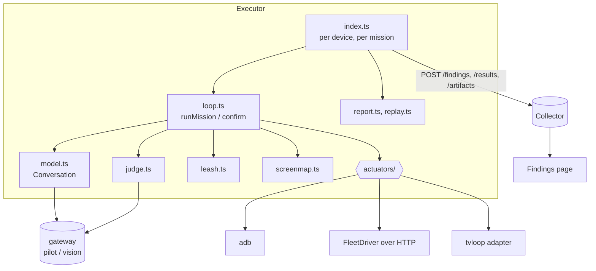

# Internals

For working on the explorer itself.

## The code

```
collector/src/workloads/explore/
  types.ts          the contract: Actuator, Observation, Action, Mission, ExploreFinding
  index.ts          the workload: params, models, missions per device, confirm and file
  loop.ts           one mission (runMission) and its replay (confirm)
  model.ts          the driver conversation, the tool dialect, calls to actions
  judge.ts          the visual and goal judge
  leash.ts          snapping, refusals, what counts as leaving the app
  screenmap.ts      screen identity and the per-app map on disk
  missions.ts       loading cards, ordering them by today's changes
  conditions.ts     dark, large text, locale, network, rotate, background
  replay.ts         Maestro flows from a trajectory; replay through the actuator
  replay-tvloop.ts  tvloop flows, for a Roku
  report.ts         steps in words, contact sheets
  image.ts          shrinking, the picture hash, blank detection, JPEG for the live view
  actuators/        android.ts, apple.ts, roku.ts and the factory in index.ts
  explore.test.ts   offline checks, including a whole mission on a fake device

collector/src/findings.ts, src/api/findings.ts   the findings store and its routes
collector/dash/src/pages/Findings.tsx           the dashboard page
runner-ios/FleetDriver/                          the XCUITest command server
bug-garden/                                      the fixture app and its defects
collector/scripts/explore-run.ts                 missions on a device, no collector
collector/scripts/explore-bench/                 pointing, steptime, image-size, bakeoff, garden-score
collector/scripts/explore-apple-check.ts         FleetDriver end to end on a simulator
collector/scripts/explore-tv-check.ts            the TV actuators end to end
collector/examples/missions/                     mission cards
collector/deploy/explore/                        gateway names, Holo4 fetch, night device script
```

## The contract

`types.ts` is what the four separately built parts agree on: actuators, the
model client, the loop, and the findings service. The one rule everything
depends on: **outside `model.ts`, every coordinate is in screenshot pixels.**
The model speaks 0–1000; `convertCall` maps to pixels; each actuator maps
pixels to its own input units (device pixels on Android, points on Apple
devices).



## Tests

`npm test` runs `scripts/check-explore.ts` before starting a collector. That
runs:

- `explore.test.ts`: the pure pieces (coordinate mapping, `input text`
  escaping, foreground parsing, focus lines, snapping and the leash, screen
  identity, fingerprints, bench checks, the Maestro file, candidate ordering,
  the accessibility rules), then **one whole mission against a fake app and a
  scripted fake model server**. That mission proves a dead control is caught on
  its second tap, a delete is refused and never performed, a crash is a
  candidate that replays from a clean install twice, and an agent's own visual
  report cannot be filed without a judge.
- `actuators/apple.test.ts` and `actuators/roku.test.ts`: their parsers, key
  maps and conversions.

The findings service's checks run inside the smoke suite against a throwaway
collector.

What `npm test` cannot cover needs a device: `explore-tv-check.ts`,
`explore-apple-check.ts`, and `explore-run.ts` against an emulator.

## Adding a check

1. Add its name to `CheckName` and `CHECK_NAMES` in `types.ts`; the collector
   validates against the list.
2. Raise it in `runMission` with `flag({...})`, giving a stable `key`. The key
   is what makes two sightings one finding, so strip what varies between them.
3. Add a case to `checkAgain` in `loop.ts` that asks the same question after a
   replay. A check with no replay case never reproduces and is never filed, by
   design.
4. If it needs a model, prefer the judge over the driver, and give it a class
   so its precision can be tracked and switched off separately.
5. Test it on the fake app in `explore.test.ts`.

## Adding a tool

Tools are defined in `model.ts` (`TOUCH_TOOLS`, `tvTools`, `SHARED_TOOLS`) and
converted in `convertCall`. Keep Holo4's names and argument shapes for anything
it already has a tool for; a model scores best in its own dialect. A new tool
that needs a capability belongs behind a `caps` check in `toolsFor`.

## Adding a surface

See [Devices: adding an actuator](surfaces.md#adding-an-actuator).

## Design rules worth keeping

- **Nothing is a finding on one sighting.** Every check raises a candidate,
  and the replay decides.
- **The model's intent is never trusted.** The leash reads the tree.
- **A miss is the agent's.** Taps near nothing never become findings.
- **Say what cannot be done.** An actuator throws with the reason, a card
  that cannot set up is skipped with the reason, and a check that cannot judge
  (no density, no judge) does not guess.
- **Different models drive and judge.**
- **The device is put back.** Conditions are journalled and restored.
- **It files and never closes.**
