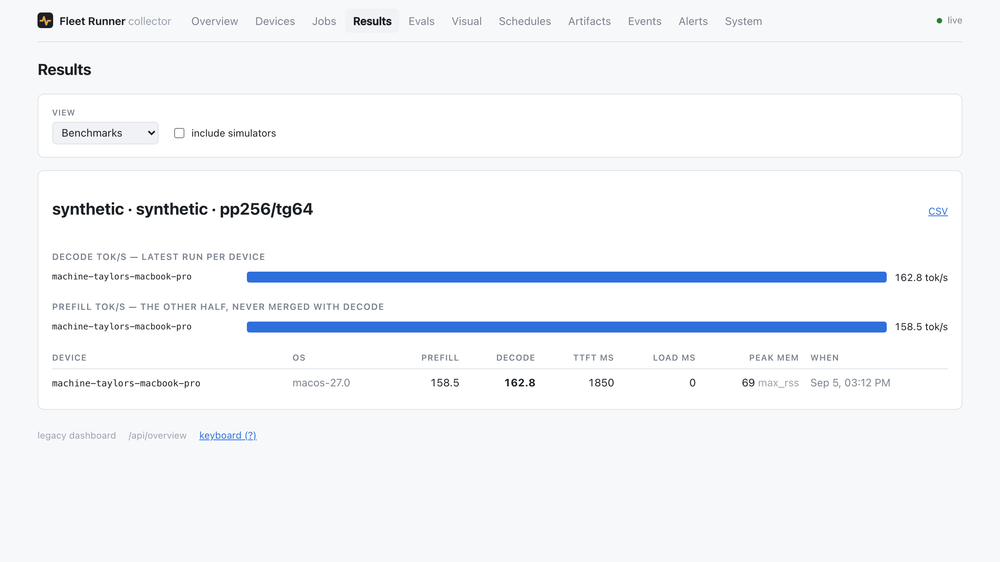

# Get started

Fifteen minutes, and at the end of it you have a real result row from a real
job in a real database, with a dashboard in front of it.

**You need Node 22 or newer, and nothing else.** No Xcode, no Android NDK, no
phone, no device on your desk. The first agent you run is your own laptop —
which is a fleet device in its own right, not a stand-in for one, and it
reports through exactly the same protocol a phone does.

Phones come [next](#adding-a-phone), once you have seen the loop work.

## 1. Start the collector

```bash
git clone https://github.com/addisdev/fleet-runner
cd fleet-runner/collector
npm install
npm start
```

That is a working collector on `http://127.0.0.1:8788` with an empty database
it creates for itself. It needs no configuration file, no broker and no cloud
service.

Check it:

```bash
curl -s http://127.0.0.1:8788/api/health
```

```json
{ "ok": true, "instance": "…", "uptime_s": 1, "node": "v26.5.0", "guard": false }
```

??? note "The dashboard needs one extra build"

    `/dash` is a Preact app with its own `package.json`, and its build output is
    gitignored. Without it the collector serves a page telling you to run the
    build, and everything else keeps working:

    ```bash
    npm run dash:install && npm run dash:build
    ```

    This is worth doing now — the last step of this page is looking at it.

## 2. Turn your laptop into a fleet device

In a second terminal:

```bash
cd fleet-runner/runner-machine
npm install
FLEET_URL=http://127.0.0.1:8788 npm start
```

```
[machine-your-hostname] fleet-runner-machine 0.1.0 on darwin/arm64, collector http://127.0.0.1:8788
[machine-your-hostname] registering with http://127.0.0.1:8788
[machine-your-hostname] registered; capabilities: benchmark, build, build:npm, self-check
```

**Read that capability list.** It is not a fixed string — the agent probed your
machine for it. `build:gradle` appears only if `gradle` resolves,
`benchmark:llama.cpp` only if `llama-bench` does. A machine with none of the
optional toolchains still declares `benchmark` and `self-check`, because both
need nothing installed. The collector will never offer this agent a workload
that is not on that list.

The agent registers as `machine-<hostname>` in the pool `machines`. Both are
overridable with `FLEET_DEVICE_ID` and `FLEET_POOLS`.

## 3. Enqueue a job

```bash
curl -X POST http://127.0.0.1:8788/jobs \
  -H 'content-type: application/json' \
  -d '{
    "schema": 1,
    "job_id": "hello-fleet",
    "workload": "benchmark",
    "executor": "device",
    "backend": "synthetic",
    "params": { "prompt_tokens": 256, "gen_tokens": 64, "warmup_iters": 1, "measure_iters": 3 },
    "targets": { "pool": "machines" }
  }'
```

```json
{ "ok": true, "job_id": "hello-fleet", "status": "queued" }
```

The agent is long-polling, so it claims the job within a second or two and runs
it. Watch the status change:

```bash
curl -s http://127.0.0.1:8788/jobs/hello-fleet
```

`queued` → `claimed` → `done`, in about ten seconds.

!!! tip "`targets.pool` has to match"

    The machine agent registers into `machines`. Ask for `ml-capable` — the pool
    the phones use in the examples elsewhere in these docs — and the job sits
    `queued` forever with nothing to explain why, because no registered device
    is in it. [Targeting](concepts.md#targeting) covers the better tool:
    `targets.match`, which is a statement about what the job needs rather than a
    label somebody has to keep accurate.

## 4. Look at what you measured

```bash
curl -s 'http://127.0.0.1:8788/api/results?job=hello-fleet'
```

```json
{
  "job_id": "hello-fleet",
  "device_id": "machine-your-hostname",
  "final": true,
  "ok": true,
  "metrics": {
    "prefill_tok_s": 158.49,
    "decode_tok_s": 162.82,
    "ttft_ms": 1850,
    "peak_mem_mb": 69,
    "mem_method": "max_rss",
    "battery_start_pct": 17,
    "battery_end_pct": 17
  }
}
```

Then open **<http://127.0.0.1:8788/dash>** and go to Results.



Those numbers are from an M1 Pro. They are not LLM throughput and the runner is
careful never to present them as such: `backend: "synthetic"` is a SHA-256
digest loop, sized in "tokens" so it produces a figure shaped like a benchmark
result. Its whole job is to be **identical on every platform, token for token**,
so a 2019 Android phone and this laptop land in the same table comparably. Real
model numbers come from `backend: "llama.cpp"`, which needs a model.

Two fields in there are the fleet refusing to round off:

- **`mem_method: "max_rss"`** says how peak memory was measured, because RSS on
  macOS and PSS on Android are not the same quantity and averaging them would
  be nonsense.
- **`battery_start_pct` and `battery_end_pct`** are recorded on a laptop that
  was on battery at 17%. A benchmark on a throttling device produces a number
  that lies, which is why [constraints](concepts.md#constraints) exist.

## Adding a phone

The laptop agent proved the loop. A phone is the same loop with a build step in
front of it.

=== "Android"

    ```bash
    cd runner-android
    ./gradlew :app:installDebug
    adb reverse tcp:8788 tcp:8788   # the phone reaches your Mac over USB
    ```

    Open the app, keep the default `http://127.0.0.1:8788`, and tap **Start
    agent**. To let the device leave your desk, set the collector URL to the
    host's address on your network instead and drop the `adb reverse`.

    Building the app needs the Android SDK. Building the *native* llama.cpp
    backend also needs NDK 27.2 and the submodule
    (`git submodule update --init --recursive`), and takes about fifteen
    minutes. You do not need it for the synthetic backend.

=== "iOS"

    ```bash
    cd runner-ios
    brew install xcodegen
    ./generate.sh
    xcodebuild -project FleetRunner.xcodeproj -scheme FleetRunner \
      -destination 'platform=iOS Simulator,name=iPhone 16' -derivedDataPath build build
    xcrun simctl install booted build/Build/Products/Debug-iphonesimulator/FleetRunner.app
    xcrun simctl launch booted com.taylab.fleetrunner -autostart 1
    ```

    A fresh clone builds with nothing else installed. What you get is the
    synthetic and Core ML backends; the llama.cpp workloads report that their
    backend is unavailable, which is the honest answer rather than a wrong
    number. Enabling it means building an 850 MB xcframework by hand — see the
    [runner's README](https://github.com/addisdev/fleet-runner/tree/main/runner-ios).

A simulator reaches `127.0.0.1` directly because it shares the Mac's network
stack. A real device needs the host's address on your network — its `.local`
name, or its tailnet address if you run one.

## Where to go next

- **[Concepts](concepts.md)** — leases, capabilities and targeting, which is
  what you need before writing a job spec that does something interesting.
- **[Workloads](workloads/index.md)** — the other twenty-odd things it can run.
- **[Wire in your app](integration/index.md)** — publish builds on merge and run
  a nightly against your own devices.
- **[Deploy](deploy/index.md)** — keeping the collector up under launchd or
  systemd, and the network gotchas that cost an evening each.

!!! warning "Before you put it on a network"

    There is no authentication, by design — anyone who can reach the collector
    can enqueue a job. `FLEET_BIND` decides which networks it answers on, and
    setting it to loopback plus your tailnet address is the configuration most
    people want. [Deploy](deploy/index.md#binding-and-exposure) has the detail.
