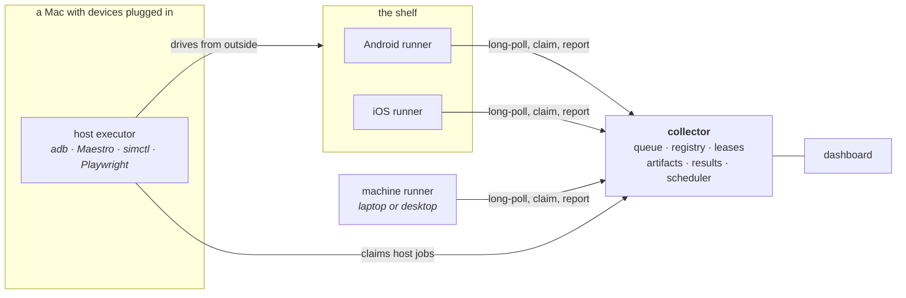

# Fleet Runner

A shelf of old phones, turned into a device lab you can send work to.

One queued job installs a build on every attached device, runs a UI suite
across them, benchmarks llama.cpp on real silicon, classifies a few hundred
images through Core ML and LiteRT, screenshots a website on two real phone
screens and diffs it against a baseline, or drains a battery on purpose and
plots the curve. Everything lands in one results database with one dashboard
in front of it.

## Start here

```
fleet up
```

A collector and a machine agent, supervised, on the machine you are typing on.
There is **no published release yet**, so getting `fleet` means building from a
checkout -- [Install](install/index.md) is honest per platform about which of
them anybody has actually run.

| | |
|---|---|
| **[Install](install/index.md)** | `fleet` onto macOS, Windows, Linux or Docker, and how a phone, a television, a Roku or a browser joins. |
| **[Get started](getting-started.md)** | `fleet up`, a real job, and a result you can look at. Node 22.13 and nothing else. |
| **[Concepts](concepts.md)** | How the queue thinks: device and host jobs, leases, capabilities, constraints, chains, fan-out and preemption. |
| **[Workloads](workloads/index.md)** | Everything the fleet knows how to run, what each one measures, and what it refuses to guess. |
| **[The protocol](protocol.md)** | Register, long-poll, claim, beacon, report. Enough to write a runner in a language none of ours are in. |
| **[Wire in your app](integration/index.md)** | Publish builds on merge, run a nightly on your own devices, block a pull request on the verdict. |
| **[Deploy](deploy/index.md)** | Where the services live, keeping them up with `fleet service`, and the networking that bites. |

## How it fits together



**Device jobs** are claimed by the agent on the device itself. **Host jobs** are
claimed by an executor on a Mac and drive a device from outside, because
installing an APK or tapping through a UI test is not something an app can do
to itself.

The runners share a protocol, not code — including a synthetic SHA-256
benchmark that is identical on every platform token for token. That is what
lets a 2019 Android phone, a current iPhone and a laptop produce numbers you
can put in the same table, which is the difference between a fleet and a pile
of phones.

## A warning worth reading before you deploy anything

**There is no authentication, by design.** The collector is meant for a home
LAN or a tailnet, and anyone who can reach it can enqueue a job. This is stated
as a posture rather than apologised for, and [the security
policy](https://github.com/addisdev/fleet-runner/blob/main/SECURITY.md)
describes what that does and does not cover. Do not put it on the internet.

## Where things live

The code is one repository with seven components that ship independently and
share no code, only the protocol.

One brain --
[`collector/`](https://github.com/addisdev/fleet-runner/tree/main/collector),
which also holds the host executor and the browser runner it serves at
`/runner`.

Five runners, in five languages, sharing not one line:
[`runner-android/`](https://github.com/addisdev/fleet-runner/tree/main/runner-android)
(Kotlin),
[`runner-ios/`](https://github.com/addisdev/fleet-runner/tree/main/runner-ios)
(Swift),
[`runner-machine/`](https://github.com/addisdev/fleet-runner/tree/main/runner-machine)
(TypeScript),
[`collector/runner-web/`](https://github.com/addisdev/fleet-runner/tree/main/collector/runner-web)
(JavaScript) and
[`runner-roku/`](https://github.com/addisdev/fleet-runner/tree/main/runner-roku)
(BrightScript, and never compiled -- see [platforms](platforms.md)).

And two front doors:
[`fleet/`](https://github.com/addisdev/fleet-runner/tree/main/fleet), the CLI
behind `fleet up`, and
[`desktop/`](https://github.com/addisdev/fleet-runner/tree/main/desktop), a
menu-bar app around it whose Rust has never been compiled.

[The history section](history/index.md) keeps the original architecture plan and
the design journals as they were written. They are not maintained, and they are
kept because the reasoning in them is why the thing is shaped as it is.
