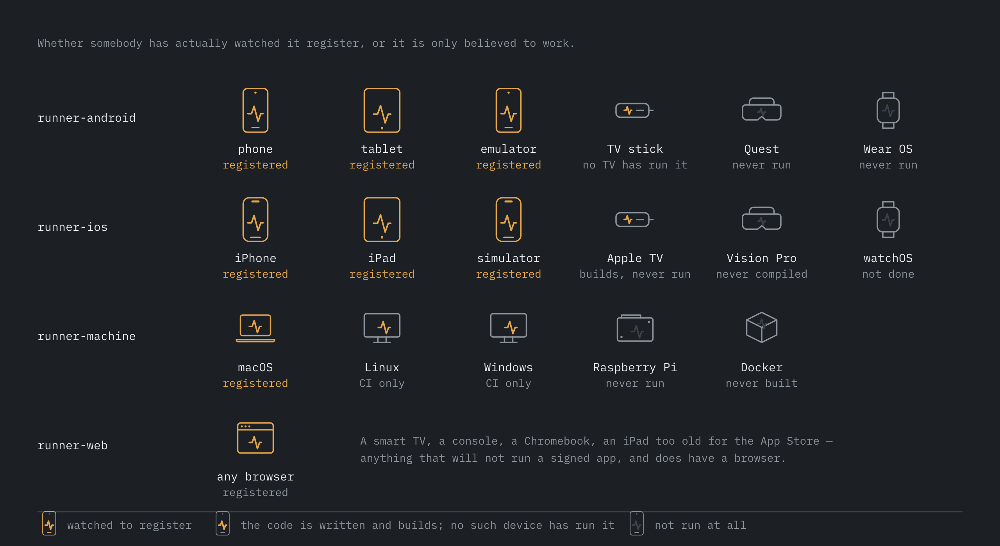
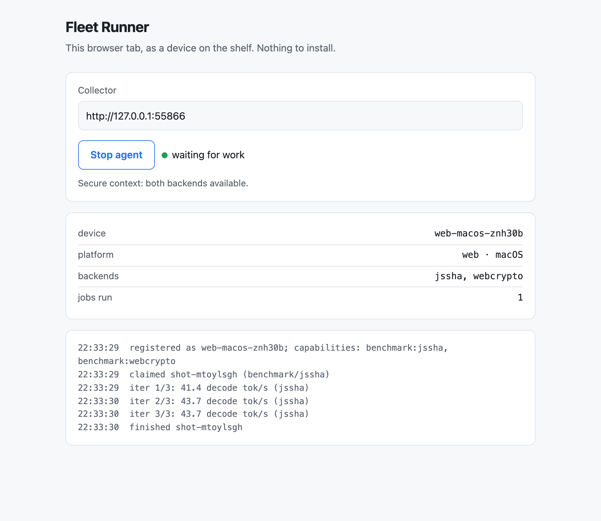

# Every screen is a device

What can join this fleet, what it takes, and — for each one — whether that has
actually been done or is only believed to work. The last column is the point of
the page. A list of platforms a project "supports" is worth very little; a list
that says which ones somebody has watched register is worth something.



## The shelf today

| Platform | Runner | How it joins | Verified |
|---|---|---|---|
| Android phone, tablet | `runner-android` | `adb install`, or sideload | **yes** — the original shelf |
| iPhone, iPad | `runner-ios` | Xcode, TestFlight internal | **yes** |
| iOS simulator | `runner-ios` | `simctl install` | **yes** |
| macOS, Linux, Windows | `runner-machine` | `npm start`, or a LaunchAgent / systemd unit | **macOS yes.** Linux and Windows run their suite in CI on x64 and arm64, and neither has registered against a real collector — see [what each one reports](#what-a-cloud-runner-actually-reports) |
| Android emulator | `runner-android` | `adb install` to the emulator | **yes** |

## What Wave 5 added

| Platform | Runner | How it joins | Verified |
|---|---|---|---|
| **Any browser** | `collector/runner-web/` | open `http://<collector>/runner` | **yes** — driven end to end by a real Chromium against a real collector, both backends, digest checked |
| **Android TV, Google TV, Fire TV** | `runner-android` | `adb connect`, then `adb install` | **partly** — the built APK declares a leanback launcher and a banner, checked with `aapt2 dump badging`. No TV has run it |
| **Meta Quest** | `runner-android` | sideload via `adb` | **no** — Quest is Android 12 and reports `UI_MODE_TYPE_NORMAL`, so the runner identifies it by the VR feature flag. Never run on one |
| **Wear OS** | `runner-android` | `adb install` over Wi-Fi debugging | **no** — the watch feature flag is read and declared; never run on one |
| **Apple TV (tvOS)** | `runner-ios`, `FleetRunnerTV` target | `devicectl` or `simctl` | **builds** — `xcodebuild -scheme FleetRunnerTV` succeeds. No Apple TV has run it |
| **Vision Pro (visionOS)** | `runner-ios`, `FleetRunnerVision` target | `devicectl` or `simctl` | **no** — the target is written and has never been compiled; the visionOS platform is not installed on the machine it was written on |
| **Raspberry Pi, Jetson, Steam Deck** | `runner-machine` | `install-agent.sh`, or the Docker image | **no** — but arm64 Linux in CI reports a nearly complete descriptor, so a board should register cleanly. No board has |
| **Anything with Docker** | `runner-machine` | `docker run` | **no** — the Dockerfile has never been built; Docker was not available on the machine that wrote it |

## What Wave 6 added

| Platform | Runner | How it joins | Verified |
|---|---|---|---|
| **Roku player, Roku TV** | `runner-roku` | `build.sh --install <ip>`, then an ECP launch | **no** -- and less verified than anything above it. No Roku was available and no Roku emulator exists, so the channel has never been *compiled*, let alone run: BrightScript's only compiler is inside a television. See [Roku: the one that could not be compiled](#roku-the-one-that-could-not-be-compiled) |
| **Roku, from the executor** | `collector/src/drivers/roku.ts` | SSDP discovery on the LAN | **partly** -- the SSDP and device-info parsers are checked against recorded response shapes in `drivers.test.ts`; the UDP socket path is exercised by nothing, and no Roku has answered it |

## Android: one APK, every shape

The Android agent is a foreground service and a text field. Nothing in it needs
a phone, and it was never a code problem — it was a packaging one. Three
declarations in the manifest do the work:

- `uses-feature android.hardware.touchscreen required="false"` (and `faketouch`).
  A television has no touchscreen, and installers and TV launchers treat that
  feature as required-by-default and filter the app out entirely.
- `category android.intent.category.LEANBACK_LAUNCHER` on the main activity.
  Without it the APK installs onto a Fire TV perfectly well and then cannot be
  started from the remote — which reads as "it does not work on TV" and is
  really "there is no icon".
- `android:banner`. A TV launcher draws a 320×180 banner, not an icon.

The phones are unaffected: declaring a feature not-required never removes it
from a device that has one.

What differs per shape is only the `kind` the runner declares, read from
`UiModeManager` and the VR and watch feature flags. A headset is asked about
before a TV, because Quest reports `UI_MODE_TYPE_NORMAL` and only the VR flag
tells the truth. Phone versus tablet has no system answer at all, so it uses
the 600 dp rule the resource system itself uses for `sw600dp`.

## Apple: one source, several products

`platform` is resolved at compile time, not from `UIDevice`, because it names
the SDK the binary was built against and that is a fact about the binary. A
tvOS build and an iOS build are different products from one source, and a
benchmark table has to be able to tell them apart.

tvOS needed exactly two accommodations, both in the sources rather than in a
fork of them:

- **No battery API.** Not a battery reading `-1` — `isBatteryMonitoringEnabled`
  does not exist, because an Apple TV is mains-powered. The runner reports 100%
  and charging, which is what a permanently plugged-in device is.
- **No WebKit.** The `web-shots:webkit` route is compiled out under
  `#if canImport(WebKit)`, so an Apple TV never *declares* the capability —
  and since the capability list is derived from the route list, the declaration
  and the code stay one act. A television advertising a screenshot workload it
  cannot run would take those jobs off the queue from the phones that can.

`WebShotsManifest.swift` stays in the tvOS target. Its header says it is kept
free of UIKit and WebKit so its parsing can be checked without a device, and
`Protocol.swift` refers to the type it defines — excluding it took the whole
protocol down with it.

**watchOS is not done.** The agent, the protocol and the Core ML backend would
compile, but watchOS has no UIKit, so `UIDevice` and `UIApplication` need
guards throughout rather than the two tvOS needed — and the watchOS platform is
not installed here, so none of it could be compiled anyway. It is the next
Apple target, not a missing one.

## The browser: the one with no install



`http://<collector>/runner` enrols the browser that opens it. A smart TV's
built-in browser, a games console, a Chromebook, a Kindle, an iPad too old for
the App Store, a friend's phone via a QR code — none of them will run a signed
native agent, and all of them have a browser.

**Read the backend name before reading a number.** The browser runner does not
declare `benchmark:synthetic`, and that is deliberate rather than an omission.
The fleet's synthetic backend measures SHA-256 throughput; a browser's only
native hash is `crypto.subtle.digest`, which is asynchronous, so a thousand
sequential folds is a thousand promise dispatches and the scheduler is a large
part of what gets measured. `crypto.subtle` is also a secure-context API, so on
`http://fleet-host.local:8788` — the address a TV browser would use — it is not
there at all.

So there are two backends, each named for what it is:

| Backend | What it measures | Available |
|---|---|---|
| `jssha` | a synchronous SHA-256 written out in the page; no dispatch overhead, so the rate is the JS engine's throughput and is comparable between browsers | always, including plain HTTP |
| `webcrypto` | the platform's native SHA-256, paying async dispatch per round | secure contexts only |

Neither is comparable with a native runner's `synthetic` rate and neither
pretends to be. What *is* comparable is correctness: both fold the identical
block through identical rounds and both report `synthetic_digest`, so the
conformance suite proves the browser is doing the fleet's arithmetic even
though its clock means something different.

A hidden tab is throttled by every browser, so the agent stops asking for work
when the page is hidden — and aborts an in-flight claim rather than waiting out
the collector's 25-second long poll, because a job handed to a tab that went
hidden in that window would be measured through the throttle. It registers with
a TTL, so a tab that is *closed* leaves the shelf instead of sitting there
forever as an offline device nobody can find.

## Roku: the one that could not be compiled

A Roku is the cheapest always-on ARM box in most houses, it is mains-powered,
and it never moves. On paper it is an ideal shelf device.
[`runner-roku/`](https://github.com/addisdev/fleet-runner/tree/main/runner-roku)
is a SceneGraph channel that speaks the protocol: it registers, long-polls,
runs the fold, beacons and reports.

**None of it has been run, and none of it has been compiled.** Roku has never
shipped an emulator and BrightScript exists only on the device, so there is no
`bsc`, no linter and no parse step available anywhere off a television. Every
other "no" in the tables above is a runner that at least builds. This one is a
careful hand review and nothing more, and the first syntax error in it will be
discovered by a sideload page. That is worth stating plainly here rather than
only in its README, because this page exists so that a row's last column can be
trusted.

### It names its backend `roevp`, for the browser's reason

BrightScript has no hash of its own. The only one on the platform is
`roEVPDigest` -- a native OpenSSL object -- called once per round from an
interpreted `for` loop, and at 4 KiB a round the native hash is a small part of
the work. The rest is the interpreter dispatching a method call, allocating the
returned hex string, parsing it back into a byte array, and copying 32 bytes
with another interpreted loop.

So the rate measures BrightScript's dispatch as much as it measures the SoC,
which is the same shape of problem as `crypto.subtle` being asynchronous, and it
gets the same answer:

| Backend | What it measures | Comparable with |
|---|---|---|
| `synthetic` | SHA-256 throughput, natively | every native runner |
| `jssha` | a browser JS engine's throughput | other browsers |
| `roevp` | one native hash per interpreted round, so mostly the BrightScript interpreter | other Rokus |

All three fold the identical block through identical rounds and all three report
`synthetic_digest`, so correctness is shared across every one of them and only
the clock differs. A job asking a Roku for `backend: "synthetic"` is refused
with a sentence rather than served a `roevp` number under that name.

### Three descriptor fields are null, and that is the interesting part

`soc`, `arch` and `ram_mb` are all null. Roku exposes no CPU model and no core
count; it has shipped both MIPS and ARM devices and no API says which one you
are on; and its only memory API is `GetGeneralMemoryLevel()`, which answers
`"normal"`, `"low"` or `"critical"`.

That last one is the refusal worth naming. It would have been easy to map three
words onto a number, and `ram_mb` is one of the two fields `targets.match` is
most often written against -- so an invented `1024` would not sit harmlessly in a
descriptor, it would decide which jobs reach the device and then appear in
tables beside numbers that were measured. The pressure signal instead rides on
every beacon as `mem_pressure`, which is a free-form string in the result schema
and the honest home for it.

Battery reads 100 and charging reads true, the same accommodation tvOS needed
and for the same reason: a Roku is mains-powered, so `require_charging` is
genuinely satisfied rather than being unmeasurable.

### Two things a Roku owner should know before trusting a number

**It only runs in the foreground.** Roku suspends a channel when the user
presses Home -- there is no background execution model for a channel and no way
to ask for one. A Roku on this fleet is a Roku dedicated to it, or one that
joins between programmes. It registers without a `ttl_s` for that reason: a
suspended channel is an offline device, not a departed one.

**Whether the screensaver suspends it is not known.** Roku's documentation does
not say whether a channel with no video playing keeps executing behind the
screensaver, is suspended, or is left running and throttled. All three are
plausible, and the third would quietly produce slow benchmark numbers with
nothing anywhere to say why. Nobody has watched a Roku long enough to find out.
The test, for whoever has one, is whether the beacons keep arriving after the
screensaver appears.

### Discovery is the first driver that is not a cable

`collector/src/drivers/roku.ts` is the first driver in the registry that reaches
devices over the network: an SSDP `M-SEARCH` for `roku:ecp`, then
`GET http://<ip>:8060/query/device-info`. adb, simctl and devicectl all answer
"what is plugged into this Mac?"; this one answers "what Rokus are on this LAN?"

The difference shows up in the shape. SSDP has no end-of-list, so discovery is a
fixed listening window rather than a command that returns -- which means a Roku
that was asleep or dropped a datagram is simply absent from one pass and present
in the next, and there is no way to tell that from there being no more Rokus.

It deliberately does **not** install. That needs HTTP digest auth, which Node's
`fetch` does not do, and hand-writing RFC 7616 against no hardware would produce
something that looks finished and fails the first time somebody has a Roku.
`runner-roku/build.sh` installs with `curl --digest` instead, reading the
developer password from the executor host's Keychain -- never from a job spec,
which is unauthenticated and rendered on the dashboard.

## What a cloud runner actually reports

The machine agent's CI matrix prints the descriptor each platform would send
rather than asserting on it, because a cloud runner is allowed to be mostly
nulls and pinning a field would fail the day a hosted image changes. What it
printed on its first run is worth writing down, because the two Linux and
Windows answers are nothing like each other.

**arm64 Linux** — near enough complete:

```json
{ "model": "Virtual Machine", "soc": null, "ram_mb": 15947,
  "os": "linux-ubuntu-24.04", "platform": "linux", "kind": "ci",
  "arch": "arm64", "cpu_cores": 4 }
```

Only `soc` is missing: `/proc/cpuinfo` on arm64 has no `model name` line, which
is the field the probe reads. A Raspberry Pi should register cleanly, and would
also fill `model` from the device tree.

**Windows** — almost nothing:

```json
{ "model": null, "soc": null, "ram_mb": null, "os": null,
  "platform": "windows", "kind": "ci", "arch": "x64",
  "gpu": null, "vram_mb": null, "cpu_cores": 4 }
```

Every field there came from `wmic`, and **`wmic` is a removed feature on
current Windows**, not merely deprecated. Only the fields Node answers by
itself survived.

The agent still registered and still ran work — the probes degrade to nulls
exactly as designed, and nothing crashed. But `os` being null meant a
`targets.match` expression could never select a Windows machine by its OS, and
`ram_mb` being null meant it could not be selected by memory either, which left
`device_id`, `platform` and `arch` as the only handles on a Windows agent.

That is the finding the platform matrix was added to produce, and it is the
reason it prints the descriptor rather than asserting on it.

### What was done about it

The Windows probes now lead with PowerShell `Get-CimInstance` and keep `wmic`
as the fallback for older installs, rather than the other way round — one
PowerShell process running six queries, because its startup is the expensive
part and this sits on the path to registration:

| Field | Class |
| --- | --- |
| `model`, `ram_mb` | `Win32_ComputerSystem` |
| `soc` | `Win32_Processor` |
| `os` | `Win32_OperatingSystem` |
| `gpu`, `vram_mb` | `Win32_VideoController` |
| `kind` | `Win32_SystemEnclosure`, then `Win32_Battery` |

The same runner now reports:

```json
{ "model": "Virtual Machine", "soc": "AMD EPYC 9V74 80-Core Processor",
  "ram_mb": 16379, "os": "windows-10.0.26100",
  "platform": "windows", "kind": "ci", "arch": "x64",
  "gpu": "Microsoft Hyper-V Video", "vram_mb": null, "cpu_cores": 4 }
```

`os` and `ram_mb` answer, so a Windows machine can be selected by its OS and by
its memory. A hosted runner is a VM, so `model` reads `Virtual Machine` — that
is a real answer, not a failure.

Two fields are null on purpose. `AdapterRAM` is a uint32, so every card with
4 GB or more reports the same saturated ceiling; reporting that as `4095` would
let a match expression asking for 16000 skip the 24 GB machine that could have
run the job, so the field says nothing instead — and the Hyper-V synthetic
adapter above has no dedicated memory to report either way. And `kind` still
reads `ci` rather than the chassis answer: a container's hardware belongs to
somebody else, and "this will be gone in four minutes" is the more useful fact.

## Adding one

1. Write the agent. It registers, long-polls, runs, reports. There is no SDK
   and no shared library, on purpose — five implementations in five languages
   keep the protocol honest in a way one library never could.
2. Declare `platform`, `kind` and `capabilities` at registration. Declare only
   what the agent can actually run: a capability it cannot honour takes a job
   off the queue from a device that could have run it.
3. Run the conformance suite: `npm run conformance -- --device <id>`. Nine
   clauses, each of them something that has actually gone wrong here. A skip is
   fine; a FAIL is a bug in the agent. See [Writing a runner](writing-a-runner.md).
4. Add a row to the table at the top of this page, and put the honest answer in
   the last column.
