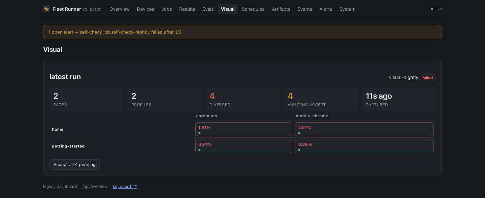

# Host workloads

Claimed by an executor process on a Mac, with `"executor": "host"`, and driving
a device from *outside* over adb or `simctl`. Installing an APK or tapping
through a UI test is not something an app can do to itself.

The executor runs wherever the devices are physically attached. See
[Deploy](../deploy/index.md) for where it lives and what it needs on `PATH`.

## `enrol`

Tell every attached device which collector to talk to, without anybody typing
an address.

```json
{ "workload": "enrol", "executor": "host",
  "params": { "url": "http://fleet-host.local:8788" } }
```

The enrolment screen has always said the hard part is typing an address on a
touch keyboard without a typo. A QR code answers that for a phone, because a
phone has a camera. It answers nothing for a television, which has neither a
camera nor a keyboard worth using, and a Roku remote has no text entry beyond an
on-screen grid.

There are two ways out: the device finds the brain, or the brain reaches the
device. [Discovery](../deploy/index.md) is the first. This is the second, and it
is the one that still works when multicast is blocked — which is guest wifi,
most offices, and every Docker bridge network.

Each driver knows its own mechanism:

| Driver | How |
|---|---|
| `adb` | `am start -S --es base_url <url>` — the Android runner has read this since the shelf was built |
| `simctl` | `simctl launch` with `SIMCTL_CHILD_FLEET_URL` |
| `devicectl` | `devicectl device process launch --payload-url fleetrunner://join?url=…` |
| `roku` | `POST /launch/dev?fleet_url=<url>` over ECP |

### It verifies, because all four fail silently

This is the whole reason the workload is more than a shell script. Every one of
those mechanisms reports success for a device that did not enrol: `am start`
exits 0 and prints `Error type 3` when the package is not installed; a `simctl
launch` succeeds against an app that ignores its environment; an ECP launch
returns 200 for a channel that then cannot reach the address it was handed.

So a device's result row is **"it registered with that collector within the
window"**, or the reason it did not — and the reason names which half failed,
the launch or the registration after it. Ninety seconds by default,
`params.wait_s` to change it.

Registration is detected by watching for a device id that was not in the
registry before. Not by name: the runner chooses its own id and nothing outside
the device can predict it — a Roku's is `GetChannelClientId()`, a per-publisher
value ECP does not expose. The cost is that an unrelated device registering
during the window would be credited to this enrolment, which on a shelf being
deliberately enrolled is a fair trade for a check that works at all.

!!! warning "A loopback address is refused"

    Omitting `params.url` uses the collector this executor claims from, which is
    usually right. If that is `127.0.0.1`, the job fails immediately rather than
    enrolling a shelf onto an address no other device can reach — a failure that
    otherwise looks like a network problem for days. Pass the LAN or tailnet
    address explicitly.

**Status: the launch path has never been run against a device.** No Android
device was attached and no simulator was booted on the machine this was written
on. What is tested is every path that decides *not* to enrol: the loopback
refusal, no targets, a driver with no mechanism, and one device's failure not
stopping the others.

The Apple half is closer than that suggests: the runner reads `FLEET_URL` from
its launch environment and handles `fleetrunner://join`, and both the iOS and
tvOS apps were built and their `Info.plist` confirmed to register the scheme.
What has not happened is a device being launched with either.

## `install`

One artifact onto every attached device — `adb install` on Android,
`simctl`/`devicectl` on iOS.

```json
{ "schema": 1, "job_id": "install-903", "workload": "install", "executor": "host",
  "app": { "name": "your-app-android", "build": "903", "sha256": "latest" } }
```

`"sha256": "latest"` resolves to the newest build published for that app name.
That is the mechanism that stops a nightly testing a build older than the code
it guards — see [Publish on merge](../integration/publish-on-merge.md).

With nothing attached, the job is claimed and fails cleanly with
`no android targets attached`, which is the correct answer rather than a hang.

## `explore`

A vision model uses tonight's build the way a person would, and leaves a short
list of reproduced bugs for the morning. EXPANSION-PLAN called it "a monkey
test with a memory"; the model was the part that did not exist yet.

```json
{ "schema": 1, "workload": "explore", "executor": "host",
  "app": { "name": "greenfolio-android", "build": "nightly", "sha256": "latest" },
  "targets": { "executor": "ultra", "match": "os ~ 'android'", "exclusive": true },
  "lease": { "ttl_s": 900, "max_attempts": 1 },
  "params": { "app_id": "com.taylab.greenfolio.debug", "app_key": "greenfolio",
              "minutes": 100, "conditions": ["baseline", "dark", "locale:es"] } }
```

**What it does, per device, per mission card.** Reset the app (install, clear
data, relaunch), sign in with the card's setup flow if it has one, then loop:
screenshot and UI tree, ask the model, check the answer against the leash, act,
read the crash and ANR logs. Each step the model hears whether the screen is
new and, after ten steps without a new one, which screens it has not reached
yet. The mission ends on the model's `answer`, its step or minute budget, or
eighteen steps without a new screen.

**The model** is any OpenAI-compatible endpoint that sees images and makes tool
calls. The tools are Holo4's own published Android set (`mobile_click`,
`mobile_write`, `mobile_scroll`... on a 0-1000 grid), plus `report_issue`, and
`tv_press` on a TV, where Holo4's tools have nothing. `params.model` names the
endpoint and model; by default it is `pilot` on ultra's gateway. The key comes
from the Keychain item `fleet-explore-gateway` (account `gateway`) or
`FLEET_EXPLORE_API_KEY`, never from the spec.

**The leash** reads the element under every tap from the tree, not from the
model's explanation. A tap within a few pixels of a control snaps onto it; a tap
near nothing is the agent's miss and never becomes a finding. Controls that
delete the account, pay, invite or sign out are refused unless the card's
`allow` names the class, and a card's `block` adds its own patterns (the
GreenFolio cards block account creation, because the debug build talks to
production). Nothing is typed into a password field.

**The checks**, and what each costs:

| Check | Evidence | Needs a model? |
|---|---|---|
| `crash`, `anr` | logcat's crash and events buffers; the simulator's log | no |
| `blank` | the app in front and one flat colour edge to edge | no |
| `frozen` | four steps of input and nothing changed, picture or tree | no |
| `dead_control` | the same tappable control tapped twice, nothing changed | no |
| `a11y` | an unlabelled control, once per new screen | no |
| `visual` | the judge model, once per new screen (overlap, clipped, raw error text, untranslated, placeholder copy, low contrast...) | the judge |
| `goal` | the judge reads the last screen against the card's `success` | the judge |

The judge is a different model from the driver (by default `vision` on the
gateway), so the run is not graded by the model that made it.

**Nothing is a finding until it replays.** Every candidate is replayed from a
clean install, twice, through the same actuator that made it, and the same
check is asked again. A crash is filed on its log even when a replay misses it;
anything else that never reproduces is dropped and counted as
`explore_not_reproduced`. What is filed goes to `POST /findings` with its steps
in words, the screenshot, a trajectory sheet and a Maestro flow that replays it.
The collector merges repeats on the fingerprint, so a crash seen again tomorrow
raises a count rather than a second report. At most `findings_per_night` new
ones (default 5) per app per night.

**Your verdicts steer it.** The Findings page has four buttons: real,
duplicate, not a bug, agent's mistake. Per app, check and visual class, once ten
are judged, a class under 30% precision is switched off at the start of the
next night. Crashes are never switched off.

**Conditions** rotate across a night's missions: `baseline`, `dark`,
`large-text`, `bold-text`, `locale:<tag>`, `network:<offline|3g|lossy>`,
`rotate` (Android) and `background` (home and back mid-mission). They are set
through the same journalled modules a11y-audit and locale-shots use, so a
device is never left in Spanish at the largest text.

**Today's changes go first.** `params.changed: {repo, since}` reads the day's
commits, turns file names into screen words (`PlantDetailScreen.kt` is "plant",
"detail") and ranks the cards whose `screens` match; the words are also given
to the model as a hint.

**Is it already broken?** `params.previous_app: {sha256}` replays each
reproduced finding on the previous build too, and the finding says whether it is
new in this build.

**Bench mode.** `params.bench: true` runs only the `bench-` cards, files
nothing, and counts how many end states (`check` on the card: text on the final
screen, the focused element, the screen's name) the model reached. That number
and the pointing test in `scripts/explore-bench/` are how models are compared.

Mission cards live in `examples/missions/<app>/*.json`. The surfaces it can
drive are the actuators under `src/workloads/explore/actuators/`: adb for phones
and Android TV / Fire TV (D-pad), the FleetDriver XCUITest bundle for iOS and
tvOS, and tvloop for a Roku.

## `upgrade-test`

Does the version users already have survive becoming this one? Almost no app
project automates this, and it is the failure that actually loses people. A
clean install passes every suite in the fleet; the path nobody runs is a real
user with two years of data taking an update and the migration dropping a table.

```json
{ "schema": 1, "job_id": "upg-1", "workload": "upgrade-test", "executor": "host",
  "app": { "name": "app-android", "build": "latest", "sha256": "latest" },
  "params": { "from_sha256": "<the build users have>",
              "seed_flow": "seed-account", "verify_flow": "account-survived",
              "app_id": "com.example.app" } }
```

Five steps: install the old build, seed it with a flow, install the new build
**over** it, launch, verify. Step three is the one that has to be right —
`adb install -r` and simctl both upgrade in place and keep the sandbox, and an
uninstall between the two would make this an install test with extra steps that
passes forever.

**The stage is on every row and is the point of the row.** A failure at
`install-old` or `seed` is the old build's problem and says nothing about the
upgrade; at `upgrade` it is packaging, a signature mismatch or a downgraded
versionCode; at `launch` it is a migration that crashes on start; at `verify` it
upgraded, it launched, and the data is wrong. "upgrade-test failed" without the
stage sends somebody to read the wrong logs.

`from_build` must already be resolved to a hash. The executor deliberately does
not resolve build names — the collector owns publish ordering, and a workload
guessing which artifact "1.4.0" meant could pick a different one than the
dashboard shows.

## `size-report`

The cheapest workload here. No device, no install, no toolchain: it fetches an
artifact a `build` job published and reads its zip central directory. So it can
run on every push forever, and the value is the trend — a graph of download size
per build answers "when did this get big" months later, which nobody can answer
retrospectively without having measured all along.

```json
{ "schema": 1, "job_id": "size-1", "workload": "size-report", "executor": "host",
  "app": { "name": "app-android", "build": "latest", "sha256": "latest" } }
```

Three numbers, because one misleads:

| Metric | What it is |
|---|---|
| `artifact_bytes` | the archive: what CI publishes and the store holds |
| `download_bytes` | the sum of compressed entries: roughly what a user waits for |
| `installed_bytes` | everything unpacked: roughly what it occupies on the device |

They differ by a lot — native libraries compress well and resources do not — and
quoting one when somebody meant another is the usual way a size report misleads.

Native libraries group **per ABI** rather than as one `lib/`. `lib/` being huge
tells you nothing you did not know; `lib/arm64-v8a` being 18 MB of it tells you
what to split.

## `ui-test`

Maestro flows or an XCUITest bundle, per device, with the JUnit report parsed
back into results and uploaded as an artifact.

```json
{ "workload": "ui-test", "executor": "host",
  "app": { "name": "your-app-android", "build": "903", "sha256": "latest" },
  "suite": { "kind": "maestro", "flows": "your-app/smoke.yaml" },
  "targets": { "exclusive": true },
  "lease": { "ttl_s": 1200 } }
```

Flows resolve relative to `flows/` (`FLEET_FLOWS_DIR` to change). `exclusive`
takes a device lock for the run, because two suites tapping the same phone is
not a test.

**iOS UI tests need a Mac with full Xcode.** `simctl` and `devicectl` ship with
Xcode, not the Command Line Tools, so they run on a different executor from the
Android work. [The iOS executor](../deploy/ios-executor.md) covers standing one
up.

## `cold-start`

Launch the installed build from cold, warm and hot; p50 and p95 per state, per
device.

**Metrics:** `launch_ms`, `launch_state`.

Cold-start on iOS is not offered: `simctl` returns at process spawn rather than
at first frame, so the number would measure the wrong thing.

## `app-soak`

Memory, jank and crashes over hours.

**Metrics:** `pss_mb`, `jank_pct`, `crashes`, `app_state`.

No PSS on an iOS simulator — only host RSS is available there, which counts
shared pages Android's PSS does not, so the two are not the same quantity and
the workload says so rather than reporting one as the other.

## `a11y-audit`

The accessibility tree diffed against a baseline, at the largest dynamic type.

Bold text below Android 12 is refused: the setting writes and nothing reads it,
so a pass would prove nothing.

## `locale-shots`

A screenshot flow under every locale, including RTL, bundled as a store-ready
contact sheet.

**Metrics:** `locales`, `shots`.

!!! tip "The check that catches a green run that measured nothing"

    It **fails a device when two locales produce byte-identical screenshots.**
    An app whose locale setting never reached it is otherwise indistinguishable
    from a correct run: the setting reads back fine, every folder exists, and
    every folder is in English.

Locale is not settable on a physical iPhone, and the workload refuses rather
than pretending.

## `web-test`

Playwright suites from `web-specs/` against `targets.url`, one result row per
config project. Needs an executor started with `FLEET_WEB=1`.

`params.browser` picks the projects: one name, an array run in sequence, or
`"all"` for everything in `playwright.config.ts`. The executor beacons between
projects, so the lease budgets one project rather than the whole matrix.

## `web-shots`

The capture half of visual regression. Reads `web-specs/<site>/shots.json` —
pages with optional `waitFor`, `mask` selectors, `fullPage` and `settle_ms`,
plus the profiles to capture under — screenshots every page × profile, and
uploads the PNGs.



Each capture is diffed with pixelmatch **on the executor**, because baselines
are only comparable to pixels rendered by the same host. A page over its
`threshold_pct` (default 0.1%) fails with `diff_pct` and a diff-image artifact.
A page with no baseline **passes** with a "new: no baseline" note until somebody
accepts a shot.

### Real phone screens

Two profile names expand to real hardware attached to the claiming executor, one
profile and one baseline per device, because two phones have two screens:

| Meta-name | Becomes | How |
|---|---|---|
| `android-device` | `android:<serial>` per Android device | Real Chrome driven via Playwright over adb |
| `ios-sim-safari` | `ios-sim:<name>` per booted simulator | Safari via `simctl openurl`, status bar pinned to 9:41 |

A meta-name that finds no hardware **fails its slot rather than quietly
shrinking the matrix**. Pin device captures to the executor whose shelf holds
the devices.

Real-iPhone Safari has no capture path; a `WKWebView` inside the runner app
covers it instead, and the profile is named `webkit` rather than `safari`
because a `WKWebView` has no reader mode and no content blockers, and somebody
reading "safari" in a baseline matrix would believe a stronger claim than the
capture supports.

## `web-audit`

Crawls `targets.url` with a real browser and audits every rendered page: titles,
descriptions, canonicals and their site-wide duplicates, h1s, JSON-LD validity,
redirect chains, broken internal links with who links them, bounded
external-link checks, sitemap-versus-crawl diff, robots.txt sanity. Then
re-renders each page under a phone profile for viewport meta, content overflow,
tiny text and tap targets.

A real browser rather than `fetch`, because these are single-page apps and
`fetch` would bless a blank body.

**Metrics:** `pages_crawled`, `issues_error`, `issues_warn`. Error-severity
findings fail the run; warnings land in the report artifact.

## `web-unfurl`

Fetches the **raw HTML** the way link-preview bots do — no JavaScript — under
several bot user-agents, and validates og and twitter tags plus the og:image
itself.

This exists because Open Graph tags injected client-side unfurl as nothing on
every platform, and **a browser-based check can never see that bug.** It needs
the raw HTML, which is the opposite of what the rest of the web auditing does.

## `drain`

Battery curve under a replayed GPX track.

**Metrics:** `drain_pct_per_h`, plus the per-sample curve.

Long-running, so the lease TTL defaults to 14400 s. Pairs with the smart-plug
[energy](../deploy/index.md#energy) support to unplug a pool before a run.

## `soak`

Whether a runner is still alive hours later — the per-check process-alive
timeline per device.

## `archive`

Pulls data the vendor will eventually delete, into the artifact store, where it
is kept forever.

- `source: "gsc"` — one finalized day of Search Console data. Google keeps 16
  months.
- `source: "asc"` — App Store Connect reviews, via an ES256 API key.
- `source: "play"` — Play Console reviews.

**Play returns roughly the last seven days of reviews and nothing older, so the
review pulls must run daily.** A lazy cadence loses data permanently.

Credentials are Keychain items on the executor host. The job spec names the
account only, never the secret — `POST /jobs` is unauthenticated, so a spec is
not a place a credential could safely live. Until the Keychain item exists the
job fails with instructions rather than silently producing nothing.

## `digest`

The weekly payoff, and the fleet eating its own cooking.

The executor gathers the week's archived reviews, dedupes by review id against
the previous digest's watermark, and **farms the LLM work to the shelf as
ordinary `batch` jobs**: one pass classifying every review against a fixed topic
taxonomy, deterministic clustering in code between the passes, one pass
summarising each cluster. Then it assembles a markdown digest with real quotes
**chosen in code, never generated**.

Devices are matched with `ram_mb >= 4000` and `require_charging`, and the job's
`model` names the GGUF the shelf runs.
