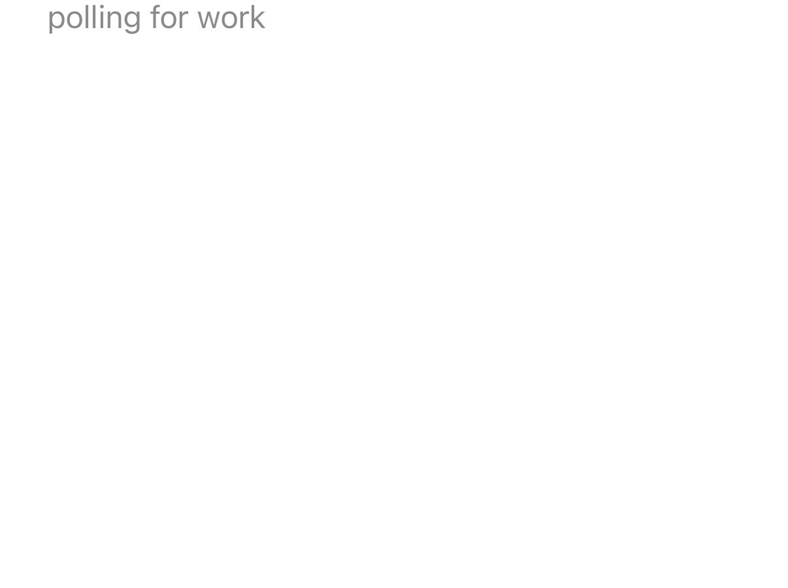

# fleet-runner-ios

The iOS half of **Fleet Runner**, a personal device lab. This app turns an
iPhone or iPad into a node that a [collector](../collector)
can send work to: llama.cpp and Core ML benchmarks, batch inference, and image
classification evals, with a telemetry beacon reporting battery, thermal state
and memory every 60 seconds.



It is deliberately a plain agent rather than an app with a UI — the screen
above is all of it. The interesting part is what happens after you press the
button.

It mirrors [`fleet-runner-android`](../runner-android)'s
JSON protocol without sharing any code, and its synthetic SHA-256 backend is
identical to the Android one token for token. That is what makes tok/s
comparable across a shelf holding both platforms, which is the whole point of
having a fleet rather than a pile of phones.

## Build & run (simulator)

Needs [XcodeGen](https://github.com/yonaskolb/XcodeGen) (`brew install xcodegen`).

```
./generate.sh
xcodebuild -project FleetRunner.xcodeproj -scheme FleetRunner \
  -destination 'platform=iOS Simulator,name=iPhone 16' -derivedDataPath build build
xcrun simctl install booted build/Build/Products/Debug-iphonesimulator/FleetRunner.app
xcrun simctl launch booted com.taylab.fleetrunner -autostart 1
```

A fresh clone builds and runs with no extra downloads. What you get is the
synthetic benchmark backend and the Core ML backend; the llama.cpp workloads
report that their backend is unavailable, which is the honest answer rather
than a wrong number.

## The llama.cpp backend

The xcframework is 850 MB, so it is gitignored and built by hand — from the
same pinned llama.cpp commit the Android JNI backend uses, which is what makes
the two platforms' tok/s comparable at all.

```
cd ../runner-android/third_party/llama.cpp
./build-xcframework.sh
cp -R build-apple/llama.xcframework ../../../runner-ios/Frameworks/
cd ../../../fleet-runner-ios && ./generate.sh
```

Run `build-xcframework.sh` from a path with no spaces in it; it passes paths to
CMake unquoted and fails confusingly otherwise.

`generate.sh` picks the spec for you: `project.llama.yml` once the framework is
there, plain `project.yml` when it is not. The two are separate specs because
Xcode treats a declared-but-missing XCFramework as a hard error rather than
something to skip, so a single spec naming it could never be built from a
clean checkout. Regenerating with the framework present will show
`FleetRunner.xcodeproj` as modified — that is expected, and the committed
version is deliberately the one without it, so that cloning and building works
with nothing else installed.

The app defaults to `http://127.0.0.1:8788`, which a simulator reaches directly
because it shares the Mac's network stack. On real devices, set the Collector
URL field to the host's address on your network (its `.local` name, or its
tailnet address if you run one); distribution is TestFlight internal.

## Phase 3 status

- [x] Protocol, collector client, agent loop, beacon, synthetic benchmark
- [x] Cross-platform benchmark table verified (iOS sim + Android emulator + SM-X930)
- [x] llama.cpp backend (xcframework), Core ML backend (vision-eval), batch + pipeline engines
- [x] host-executor iOS path (simctl + devicectl install, XCUITest bundle)
- [ ] Real-device battery/charging telemetry validation (simulator reports -1)

## License

MIT — see [LICENSE](LICENSE). What the app links when you build it, and under
what terms, is in [THIRD_PARTY_NOTICES.md](THIRD_PARTY_NOTICES.md).
